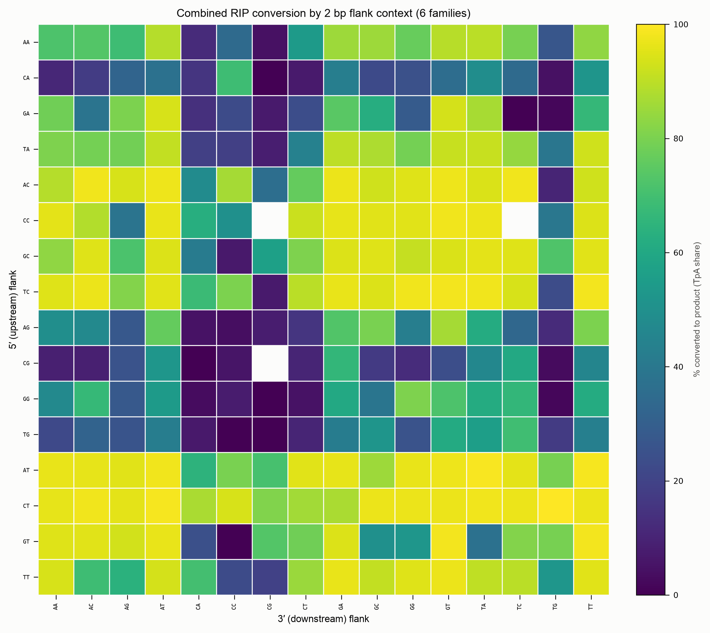
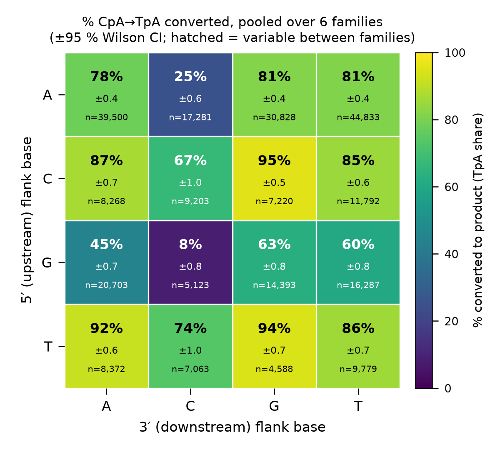
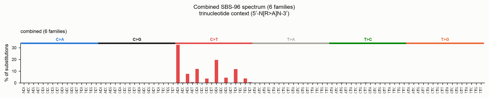
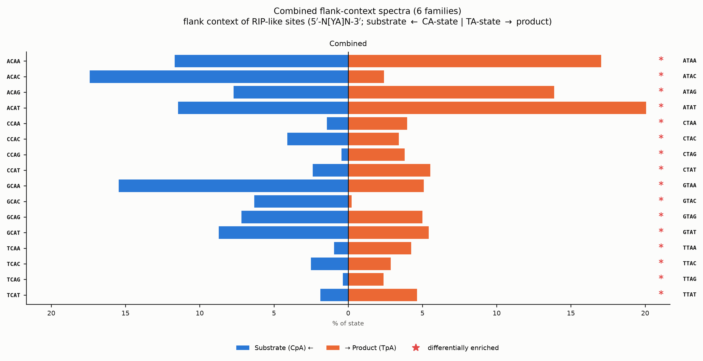

# Combined spectra across many alignments (Python API)

A single alignment tells you how RIP shaped **one** transposon family. To ask what
RIP does *in general* — across many families, or across a panel of species — you
need to combine the spectra of many independent alignments into one signature. This
page shows how to drive deRIP2's per-alignment spectra over a corpus of MSAs and
pool them into three combined views:

- the **SBS-96** mutation spectrum,
- the 16-channel **flank-context bihistogram** of RIP substrate/product sites,
- the configurable-width **flank RIP-conversion heatmap** (1/2/3 bp).

The one genuinely tricky part is combining conversion *rates*, so we deal with it
head-on: **pool counts, don't average percentages.**

!!! note "Reproducible demo"
    Every snippet below runs against the bundled `tests/data/sahana.fasta.gz`,
    which we split into groups to *simulate* independent families. For real work,
    replace the loop over groups with a loop over your own per-family FASTA files —
    the aggregation code is identical.

## Extracting one alignment at a time

For each alignment, run RIP detection once, then pull the pooled flank spectra (at
each flank width you care about) and the pooled SBS-96 spectrum. We keep only the
compact count vectors so many families fit comfortably in memory.

```python
import gzip
import numpy as np
from Bio import SeqIO
from Bio.Align import MultipleSeqAlignment
from derip2.derip import DeRIP

FLANK_WIDTHS = (1, 2, 3)

def extract_family(aln):
    """Return pooled flank substrate/product counts and the SBS-96 vector."""
    d = DeRIP(aln)
    d.calculate_rip()
    flank = {}
    for w in FLANK_WIDTHS:
        pooled = d.calculate_flank_spectra(flank_length=w).pooled()
        flank[w] = {
            "substrate": pooled["sub_fwd"] + pooled["sub_rev"],   # (4**2w,)
            "product":   pooled["prod_fwd"] + pooled["prod_rev"],
        }
    sbs = d.calculate_spectra(partition_by="none").sbs96[:, 0]     # (96,)
    return {"n_seqs": len(aln), "flank": flank, "sbs96": sbs}
```

Now build the corpus. In the demo we split Sahana into six contiguous groups; for
real data you would iterate over `glob.glob("family_msas/*.fasta")` and read each
file instead.

```python
import math

records = list(SeqIO.parse(gzip.open("tests/data/sahana.fasta.gz", "rt"), "fasta"))
size = math.ceil(len(records) / 6)
groups = [records[i:i + size] for i in range(0, len(records), size)]

per_family = [extract_family(MultipleSeqAlignment(g)) for g in groups if len(g) >= 2]
print(f"{len(per_family)} families, {sum(f['n_seqs'] for f in per_family)} sequences")
```

## Pooling: why counts, not rates

The biologically interesting quantity is each flank motif's **product share** —
`product / (substrate + product)`, the fraction of that context converted to RIP
product. The wrong way to combine it across families is to average the per-family
percentages: families differ enormously in how many sites of each motif they carry,
so a family with three sites of a rare motif would count as much as one with thirty
thousand.

Instead, **pool the counts**. Summing substrate and product across families and
*then* taking the ratio gives a binomial success rate whose precision scales with
the pooled sample size — automatically sample-size-weighted:

```python
def pool_flank(per_family, width):
    n = 4 ** (2 * width)
    substrate = np.zeros(n, dtype=np.int64)
    product = np.zeros(n, dtype=np.int64)
    for f in per_family:
        substrate += f["flank"][width]["substrate"].astype(np.int64)
        product += f["flank"][width]["product"].astype(np.int64)
    total = substrate + product
    with np.errstate(invalid="ignore", divide="ignore"):
        rate = np.where(total > 0, product / total, np.nan)     # pooled % conversion
    return substrate, product, total, rate
```

### The error margin: a Wilson confidence interval

A pooled rate is only as trustworthy as its `n`. Attach a **Wilson score 95 %
confidence interval** — it stays inside `[0, 1]` and behaves well at extreme rates
and small counts, unlike the textbook normal interval, which is exactly the regime
of rarely-seen motifs. (This needs only `math`; no SciPy.)

```python
import math

def wilson_ci(success, n, alpha=0.05):
    if n <= 0:
        return (float("nan"), float("nan"))
    z = 1.959963984540054                       # normal quantile for alpha=0.05
    p = success / n
    denom = 1 + z * z / n
    centre = (p + z * z / (2 * n)) / denom
    half = (z / denom) * math.sqrt(p * (1 - p) / n + z * z / (4 * n * n))
    return (max(0.0, centre - half), min(1.0, centre + half))

sub, prod, total, rate = pool_flank(per_family, 1)
for i in np.argsort(-np.nan_to_num(rate))[:5]:
    lo, hi = wilson_ci(int(prod[i]), int(total[i]))
    print(f"motif {i:2d}  {rate[i]*100:5.1f}%  [{lo*100:4.1f}, {hi*100:4.1f}]  n={total[i]:,}")
```

### Between-family variability

Pooling answers "what is the conversion rate overall", but hides whether families
*agree*. Keep that signal by also computing each family's own rate (gated to
families with enough sites) and reporting the **mean ± SD across families**. A high
SD flags a motif whose conversion is family-dependent rather than universal.

```python
def family_dispersion(per_family, width, min_sites=20):
    rates = []
    for f in per_family:
        s = f["flank"][width]["substrate"].astype(float)
        p = f["flank"][width]["product"].astype(float)
        tot = s + p
        with np.errstate(invalid="ignore", divide="ignore"):
            rates.append(np.where(tot >= min_sites, p / tot, np.nan))
    rates = np.vstack(rates)
    return np.nanmean(rates, axis=0), np.nanstd(rates, axis=0)   # mean, SD per motif
```

!!! tip "Read the pooled rate and the family SD together"
    A motif can show a confident pooled rate (tight Wilson CI, because `n` is large)
    yet still vary widely between families (large SD). The CI is *sampling*
    uncertainty; the SD is *biological* heterogeneity — they answer different
    questions.

## Plotting the combined views

deRIP2's plotters take a result object, not raw arrays. Rather than reimplement
them, synthesise a **single-column result** from the pooled counts and hand it
straight to the stock plotters. Both result types are dataclasses, so this is a
one-liner per view.

### Combined flank heatmaps (1/2/3 bp)

Place the pooled substrate/product totals on a one-sample
[`FlankSpectraResult`](flank-context-spectra.md) and call the stock heatmap:

```python
from derip2.stats.flank_spectra import FlankSpectraResult
from derip2.spectra.flank_channels import flank_channel_labels
from derip2.plotting.flank_spectra import plot_flank_conversion_heatmap

def combined_flank_result(per_family, width):
    sub, prod, _total, _rate = pool_flank(per_family, width)
    n = sub.shape[0]
    zero = np.zeros((n, 1))
    return FlankSpectraResult(
        sub_fwd=sub.astype(float)[:, None], sub_rev=zero.copy(),
        prod_fwd=prod.astype(float)[:, None], prod_rev=zero.copy(),
        sample_names=[f"combined ({len(per_family)} families)"],
        n_skipped_flank={}, flank_length=width,
        channels_substrate=list(flank_channel_labels("CA", width=width)),
        channels_product=list(flank_channel_labels("TA", width=width)),
    )

for w in (2, 3):
    plot_flank_conversion_heatmap(
        combined_flank_result(per_family, w), sample=None,
        outfile=f"combined_flank_heatmap_{w}bp.png",
        title=f"Combined RIP conversion by {w} bp flank context",
    )
```



The stock heatmap annotates counts but not the confidence interval. For the 4×4
**1 bp** grid there is room to show the pooled percentage, its Wilson CI half-width
and the pooled `n` in every cell — and to hatch cells whose between-family SD is
high. The `experiments/combined_spectra/fig_flank_heatmaps.py` script draws exactly
this; it produces:



The nearest-3′ **C** column is the darkest — a downstream cytosine protects the
target CpA from RIP regardless of the 5′ base — reproducing the single-family
result on a pooled, error-barred footing.

### Combined SBS-96

Same idea with a one-sample
[`SpectraResult`](mutation-spectra.md); the SBS-96 plotter reads only the matrix and
sample name, so the event-level fields can be left empty. Plot as `percentage=True`
so families of different sizes compare on equal footing:

```python
from derip2.stats.mutation_spectra import SpectraResult
from derip2.plotting.spectra import plot_sbs96

pooled96 = sum(f["sbs96"].astype(np.int64) for f in per_family)
empty_i, empty_s = np.zeros(0, dtype=int), np.zeros(0, dtype="S1")
combined_sbs = SpectraResult(
    sbs96=pooled96.astype(float)[:, None], sbs192=None,
    sample_names=[f"combined ({len(per_family)} families)"],
    event_rows=empty_i, event_cols=empty_i, event_ref=empty_s, event_alt=empty_s,
    event_five=empty_s, event_three=empty_s, event_sample=empty_i,
    homoplasy_counts=np.zeros((0, 4), dtype=int), ancestor_ref=empty_s,
    n_indel_or_ambiguous=0, n_unassignable_context=0,
)
plot_sbs96(combined_sbs, outfile="combined_sbs96.png", sample=0, percentage=True,
           title="Combined SBS-96 spectrum")
```



All the signal sits in the `C>T` block, concentrated in `NCA` contexts — the
canonical RIP signature, now pooled across the whole corpus.

### Combined bihistogram

Reuse the 1 bp `combined_flank_result` and draw the pooled bihistogram. Restrict it
to the combined panel (the pooled counts have no meaningful per-strand split) and
normalise each state to 100 % of its own sites:

```python
from derip2.plotting.flank_spectra import plot_flank_bihistograms_pooled

plot_flank_bihistograms_pooled(
    combined_flank_result(per_family, 1), outfile="combined_flank_bihistogram.png",
    strands=("combined",), percentage=True, title="Combined flank-context spectra",
)
```



Motifs whose substrate and product proportions differ significantly are marked `*`
(via [`differential_channels`](flank-context-spectra.md#identifying-individually-different-motifs)).

## Comparing the combined spectra of two panels

Once you have pooled spectra for two groups — say RIP-positive vs RIP-negative
species — compare them with the scale-free tools from
[`spectra_compare`](flank-context-spectra.md#comparing-two-sets-of-spectra): cosine
similarity for shape, χ² / Cramér's V for significance and effect size. Because
cosine similarity is scale-free, it is unaffected by the two panels having very
different total counts.

```python
from derip2.stats.spectra_compare import compare_spectra

a = sum(f["sbs96"].astype(np.int64) for f in panel_a)
b = sum(f["sbs96"].astype(np.int64) for f in panel_b)
cmp = compare_spectra(a, b)
print(cmp["cosine_similarity"], cmp["cramers_v"], cmp["pvalue"])
```

## Reproducing the manuscript figures

The `experiments/combined_spectra/` scripts wrap everything above with per-family
JSON caching and a `--demo` / `--input-dir` switch:

```bash
python experiments/combined_spectra/aggregate.py --input-dir family_msas -v
python experiments/combined_spectra/fig_flank_heatmaps.py           # 1/2/3 bp heatmaps
python experiments/combined_spectra/fig_sbs96_combined.py           # SBS-96
python experiments/combined_spectra/fig_flank_bihistogram_combined.py
```

Omit `--input-dir` for the reproducible Sahana demo used to render the figures on
this page.

## See also

- [Flank-context spectra](flank-context-spectra.md) — the single-alignment flank
  analysis these combined views pool over.
- [Mutation spectra](mutation-spectra.md) — the SBS-96/192 model and the
  `derip2-spectra` CLI.
