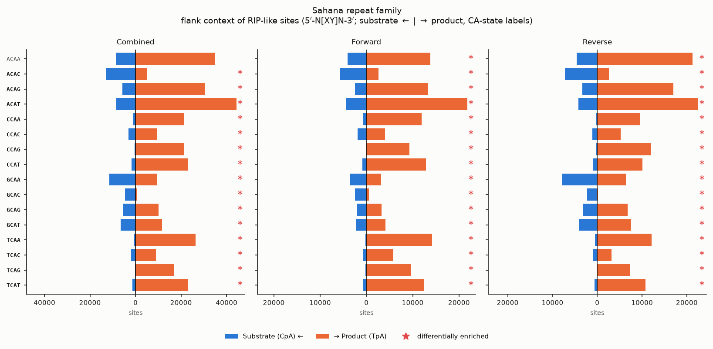

# Flank-context spectra of RIP-like sites (Python API)

Not every RIP substrate is converted. deRIP2 can ask whether a **local sequence
context protects** a substrate from RIP by classifying every RIP-like
dinucleotide by the single base **1 bp upstream and 1 bp downstream** — a 4 bp
motif `[up][centre][down]` with the two centre bases fixed and the flanks varying,
giving **16 channels**. Two site states are counted:

- **Substrate** — surviving `CpA` (forward) / `TpG` (reverse), counted *anywhere*
  in each sequence.
- **Product** — realised `TpA` in a RIP-informative column.

Reverse-strand motifs are reverse-complemented onto the `CpA`/`TpA` strand, so a
substrate `GCAG` and its product `GTAG` share one flank channel (the **CA-state**
label `GCAG`).

The per-sequence HTML report renders this automatically (see
[Per-sequence Reporting](per-sequence-reporting.md#flanking-context-spectra-of-rip-like-sites)).
This page shows how to drive the same analysis from Python: extract the spectra,
plot them, rank motifs by conversion, compare two spectra sets, and flag the
individual motifs that differ — with a note on normalising for sample size.

## Extracting the spectra

Run RIP detection, then compute the flank spectra. The result is a
`FlankSpectraResult` with one sample column per input sequence.

```python
from derip2.derip import DeRIP

d = DeRIP("tests/data/sahana.fasta.gz")
d.calculate_rip()
result = d.calculate_flank_spectra()      # cached on d.flank_spectra_result

result.sample_names          # one label per aligned sequence
result.channels_substrate    # 16 CA-state motifs: ['ACAA', 'ACAC', ..., 'TCAT']
result.channels_product      # the equivalent TA-state motifs: ['ATAA', ...]
```

Each state/strand is a `(16, n_sequences)` count matrix. Pull them with
`.matrix(state, strand)`, or pool every sequence into a single alignment-wide
spectrum with `.pooled()`:

```python
import numpy as np

# Per-sequence, combined strands:
sub_by_seq = result.matrix("substrate", "combined")   # (16, n_sequences)
prod_by_seq = result.matrix("product", "combined")

# Alignment-wide (pooled) 16-vectors:
pooled = result.pooled()                               # dict of (16,) vectors
substrate = pooled["sub_fwd"] + pooled["sub_rev"]      # combined substrate
product = pooled["prod_fwd"] + pooled["prod_rev"]      # combined product
motifs = result.channels_substrate
```

`state` is `"substrate"` or `"product"`; `strand` is `"combined"`, `"forward"` or
`"reverse"`. Substrate counts use the raw `CpA`/`TpG` masks (every surviving
substrate), while product counts are gated to RIP-informative columns — this
asymmetry is deliberate. Sites at an alignment edge that lack a resolvable 4 bp
context are dropped and tallied in `result.n_skipped_flank`.

To compute directly from a `ColumnClassification` (e.g. outside a `DeRIP`
object), call the underlying function:

```python
from derip2.stats.flank_spectra import compute_flank_spectra

ids = [record.id for record in d.alignment]
result = compute_flank_spectra(d.column_classes, sample_names=ids)
```

## Plotting

`DeRIP.plot_flank_spectra()` draws the pooled bihistograms (substrate left,
product right; CA-state motif on the left axis, TA-state on the right; motifs that
differ significantly between states marked `*`):

```python
fig = d.plot_flank_spectra(title="Sahana repeat family")
fig.savefig("sahana_flank.png", dpi=150, bbox_inches="tight")
```



### Count-normalised proportions

By default the bars are raw counts. There are usually far more substrate sites
than product sites (substrate is counted everywhere, product only in RIP columns),
so the raw bihistogram is dominated by that overall imbalance. Pass
`percentage=True` to plot **count-normalised proportions** instead: each state is
rescaled to sum to 100 % across the 16 motifs, so the substrate and product
*shapes* are compared on equal footing and you can see which contexts are
over- or under-represented in one state relative to the other.

```python
# Each state normalised to 100 % of its own sites (x-axis: "% of state"):
fig = d.plot_flank_spectra(title="Sahana repeat family", percentage=True)
fig.savefig("sahana_flank_proportions.png", dpi=150, bbox_inches="tight")
```

For finer control use the plotting functions directly. `strands` selects which
panels to draw (the report overview uses `("combined",)`); `sample` picks one
sequence; `percentage` works here too:

```python
from derip2.plotting.flank_spectra import (
    plot_flank_bihistograms,          # one sequence
    plot_flank_bihistograms_pooled,   # all sequences pooled
)

# Just the combined panel, pooled across the alignment, as proportions:
plot_flank_bihistograms_pooled(
    result, strands=("combined",), percentage=True, outfile="combined.png"
)

# All three strand panels for the first sequence (raw counts):
plot_flank_bihistograms(result, sample=0, outfile="seq0_flank.png")
```

## Ranking motifs by RIP conversion

The biologically interesting quantity is the **product share** of each flank
context — `product / (substrate + product)` — i.e. how readily that context is
converted to RIP product. Rank the motifs by it:

```python
total = substrate + product
with np.errstate(invalid="ignore"):
    pct_converted = np.where(total > 0, 100.0 * product / total, np.nan)

order = np.argsort(-np.nan_to_num(pct_converted))     # most-converted first
for i in order[:5]:
    print(f"{motifs[i]}  {pct_converted[i]:5.1f}%  (n={int(total[i])})")
```

```text
CCAG   98.5%  (n=21591)
TCAG   98.4%  (n=17065)
TCAA   97.4%  (n=26980)
...
```

Always read the percentage next to the total `n`: a context with only a handful of
sites can show an extreme conversion rate by chance. This is exactly the
`Motif / Substrate / Product / Total / % RIP` table rendered (and sortable) in the
HTML report.

## Comparing two sets of spectra

To ask whether two spectra differ — two families, two clades, or substrate vs
product within one alignment — use
`derip2.stats.spectra_compare.compare_spectra`, which returns a scale-free
**cosine similarity** (shape), the **χ² homogeneity** test (significance) and
**Cramér's V** (effect size):

```python
from derip2.stats.spectra_compare import compare_spectra

cmp = compare_spectra(substrate, product, channels=motifs)
cmp["cosine_similarity"]   # 1.0 = identical flank preference
cmp["cramers_v"]           # effect size in [0, 1]
cmp["pvalue"]              # chi-squared homogeneity p-value
cmp["top_channels"]        # the most-differentiating motifs
```

For the five built-in substrate-vs-product / strand comparisons in one call, use
`compare_flank_spectra` (per sequence) or `compare_flank_spectra_pooled`
(alignment-wide):

```python
from derip2.stats.flank_spectra import compare_flank_spectra_pooled

comparisons = compare_flank_spectra_pooled(result)
comparisons["sub_vs_prod_combined"]["cosine_similarity"]
comparisons["fwd_vs_rev_product"]["cramers_v"]
```

Each comparison carries a `chi2_reliable` flag (both spectra have ≥ `min_sites`
sites); the report only shows a p-value when it is set.

## Identifying individually-different motifs

`differential_channels` flags *which* motifs drive a substrate-vs-product
difference. For each of the 16 contexts it forms one row of a 16×2 table and tests
that cell's **adjusted standardised (Haberman) residual** against the standard
normal — a motif is flagged when `|z| ≥ z(α)` (two-sided), provided both states
have at least `min_sites` sites, with no multiple-testing correction:

```python
from derip2.stats.flank_spectra import differential_channels

flagged = differential_channels(substrate, product, min_sites=20, alpha=0.05)
[motifs[i] for i in np.nonzero(flagged)[0]]     # significantly enriched motifs
```

These are the motifs marked `*` on the bihistograms. The same function works on
any two 16-vectors, e.g. the product spectra of two different families.

## Normalising for sample size

Counts scale with alignment size and RIP load, so be deliberate when comparing:

- **Cosine similarity is already scale-free.** It compares the *shape* of two
  spectra, so `compare_spectra(a, b)` gives the same value whether `a`/`b` are raw
  counts or proportions. Reach for it first when the two spectra have very
  different totals.

  ```python
  # identical cosine, whether counts or proportions:
  sp, pp = substrate / substrate.sum(), product / product.sum()
  compare_spectra(sp, pp)["cosine_similarity"] == compare_spectra(substrate, product)["cosine_similarity"]
  ```

- **The χ² p-value is powered by n.** With large pooled counts almost every
  context becomes "significant" (on the full Sahana family nearly all 16 motifs
  flag), so lead with the effect sizes — **cosine** and **Cramér's V** — and treat
  the p-value as a yes/no on *whether* there is any difference, not *how much*.

- **To compare composition across samples of different sizes**, normalise each
  spectrum to proportions (divide by its own total, or use the
  [`percentage=True`](#count-normalised-proportions) option on the plot functions)
  before eyeballing them. Keep the raw counts for the tests, which need integer
  frequencies.

- **Per-sequence spectra are small.** The `min_sites` gate (default 20) stops
  `differential_channels` and the report's per-motif marks from over-interpreting
  a sequence with only a few RIP-like sites; raise it for noisier data.

## Writing the tables

The tidy count matrix and comparison statistics can be written straight to TSV
(these are also emitted next to the HTML report):

```python
d.write_flank_spectra_matrix("rip_context_spectra.tsv")        # sample x state x strand x channel
d.write_flank_spectra_comparisons("rip_context_comparisons.tsv")
```

## See also

- [Per-sequence Reporting](per-sequence-reporting.md) — the HTML section that
  renders these spectra, the sortable per-motif table, and the comparisons.
- [Mutation spectra](mutation-spectra.md) — the SBS-96/192 substitution spectra
  (a different context model for the same substitutions).
