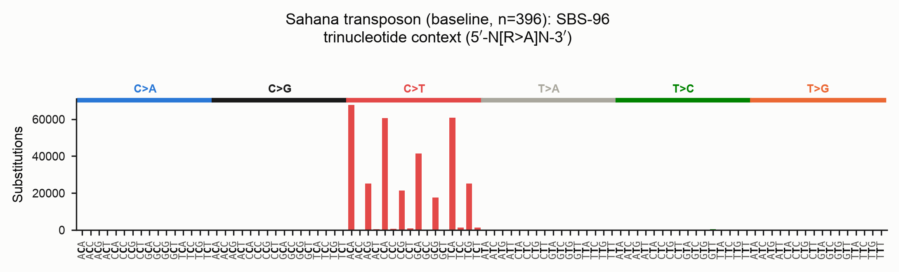
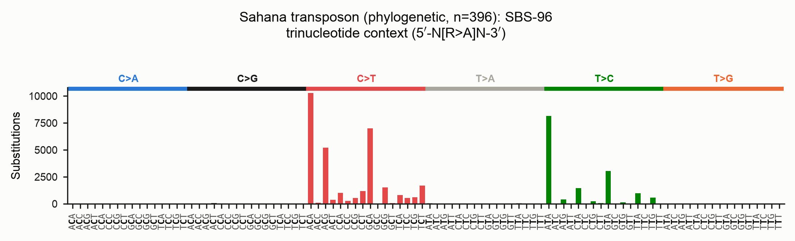
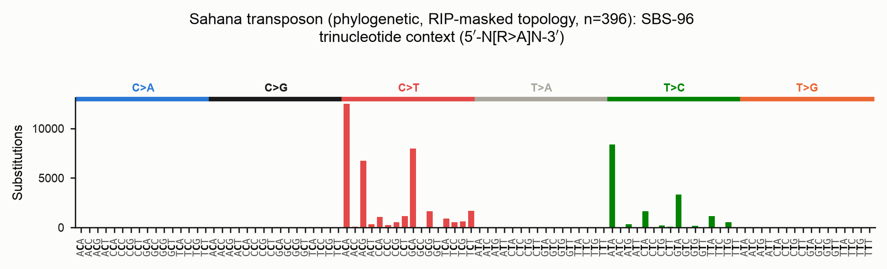
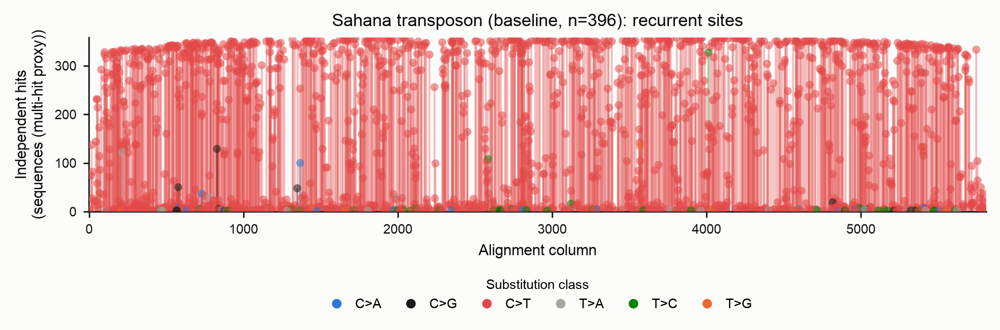
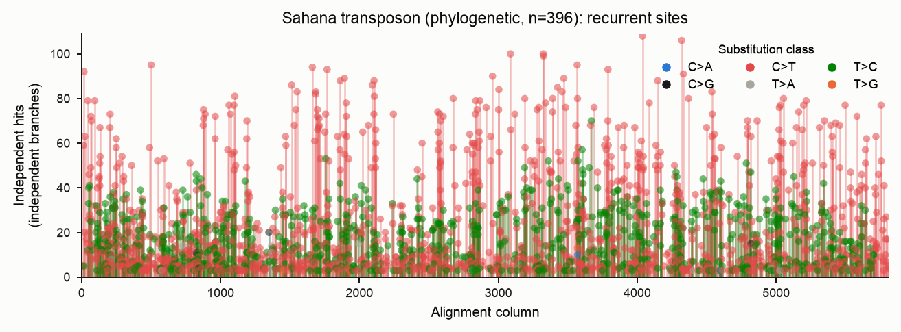
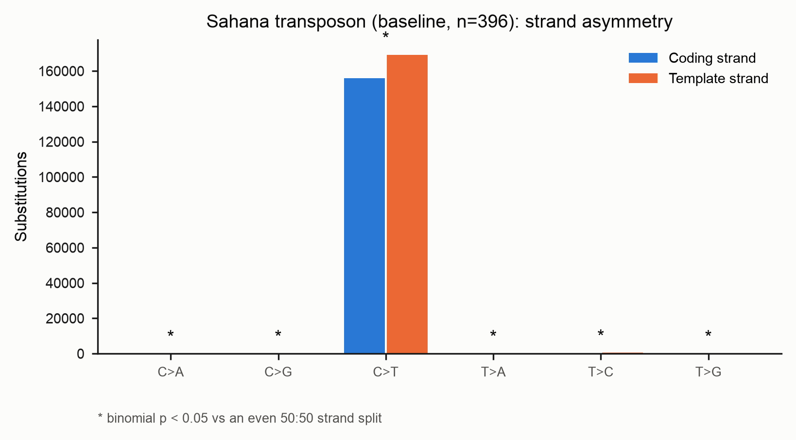
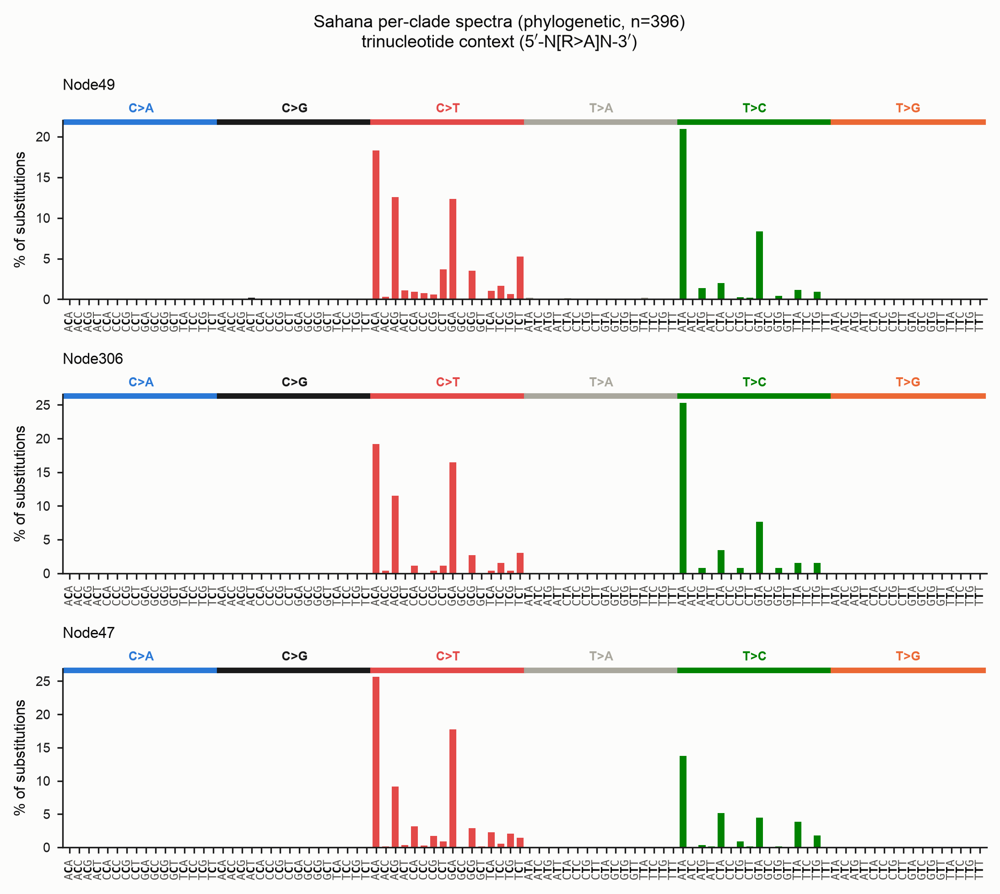
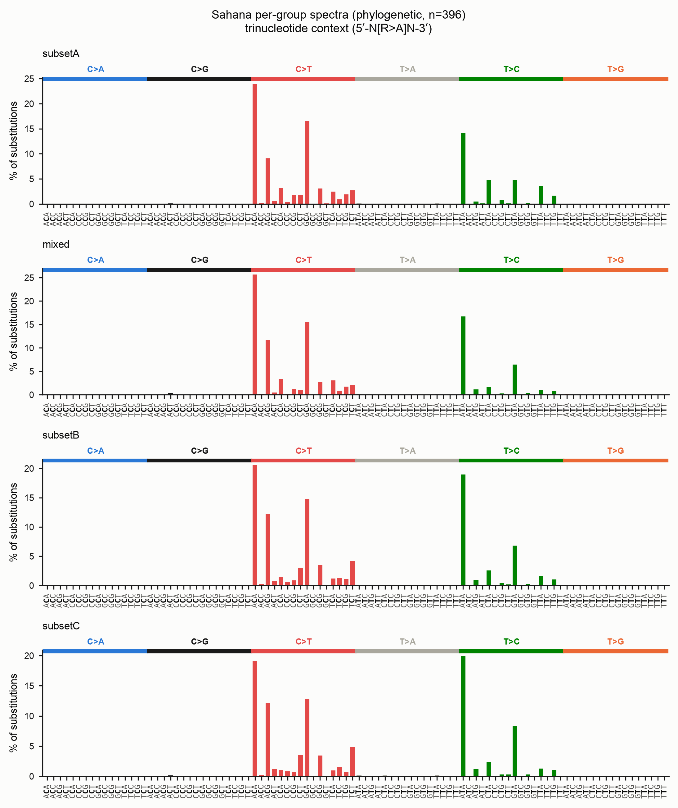
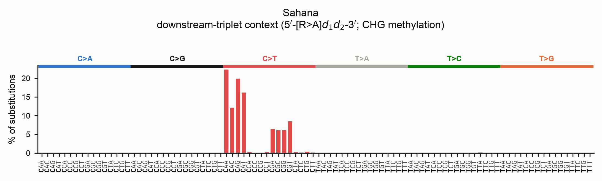

# Mutation spectra (SBS-96 / SBS-192)

RIP is one of several processes that deaminate cytosine in fungal repeats. To tell
them apart you need more than a count of C→T changes — you need the **sequence
context** each change happened in. `derip2-spectra` builds the standard
single-base-substitution spectra used in mutational-signature analysis:

- **SBS-96** — every substitution folded onto the pyrimidine strand, classified by
  its 5′ and 3′ neighbours: 6 substitution types × 16 contexts = 96 channels.
- **SBS-192** — the strand-resolved form (12 types × 16 contexts) that keeps the
  reference base as observed on the coding strand, so strand asymmetries stay
  visible.

RIP (CpA → TpA) shows up as a sharp `C>T` peak concentrated in `NCA` contexts:



The matrices are written in SigProfiler-compliant format, so they drop straight
into `SigProfilerPlotting` / `SigProfilerAssignment` if you want to decompose them
against COSMIC signatures later.

There is also a third, CHG-aware context — the **downstream-triplet** — described
in [its own section](#downstream-triplet-context-chg-methylation) below.

## Quick start

```bash
derip2-spectra -i family.fasta -d out -p family
```

This writes, into `out/`:

| File | Contents |
|---|---|
| `family.SBS96.txt`, `family.SBS192.txt` | SigProfiler-compliant count matrices |
| `family_SBS96.png`, `family_SBS192.png` | spectrum bar plots |
| `family_strand_asymmetry.png` | coding- vs template-strand counts per class |
| `family_homoplasy.png`, `family_homoplasy.tsv` | recurrently-hit sites |
| `family_events.tsv` | one row per called substitution |

## Two methods: baseline and phylogenetic

Direction and recurrence are not free from an alignment — you need an ancestor. The
tool offers two ways to get one.

### Baseline (`--method baseline`, the default)

Every sequence is compared to a **single reference** — deRIP2's reconstructed
ancestral consensus — and each difference is one event, with its context read from
that ancestor. It needs no tree and no external tools.

Its blind spot is **recurrence**. If the same C→T deamination struck independently
on many lineages, comparing every tip to one reference records the derived state on
each tip and cannot tell "one ancestral event inherited by twenty tips" from
"twenty independent events". The baseline therefore *over-counts* homoplasic sites
and reports recurrence only as a *multi-hit-column* proxy.

#### Worked example: the baseline ancestor

By default you do not have to build the ancestor yourself — `derip2-spectra`
reconstructs it internally by running deRIP2's correction, then compares every
sequence to it:

```bash
derip2-spectra -i family.fasta --method baseline -d out -p family
```

The ancestor it uses is deRIP2's **gapped deRIP consensus**: for every column,
deRIP2 finds the un-RIP'd ancestral base (a `C` where RIP produced `T`, a `G`
where it produced `A`) by looking across all copies for one that escaped RIP, and
falls back to the majority base elsewhere. This is exactly the sequence the plain
`derip2` command writes to `family.fasta`, so the two are consistent.

If you want to see or reuse that ancestor, run `derip2` first and pass it back
with `--ancestor`:

```bash
# 1. Reconstruct the deRIP'd ancestral consensus (writes out/family.fasta)
derip2 -i family.fasta -d out -p family

# 2. Call the spectrum against that explicit ancestor
derip2-spectra -i family.fasta --method baseline \
    --ancestor out/family.fasta -d out -p family_spectrum
```

`--ancestor` accepts any FASTA whose single sequence is the **same length as the
alignment** (one base per column, gaps allowed). Use it when you have an
independent progenitor — a known germline element, a manually curated ancestor,
or a consensus built under different deRIP settings (e.g. `derip2 --reaminate` to
treat *all* cytosine deamination as ancestral, not just RIP-context events). The
deRIP parameters on `derip2-spectra` itself (`--max-gaps`, `--reaminate`,
`--min-rip-like`, …) tune the *internal* ancestor when you do not supply one.

```python
# The same thing from Python
from derip2.derip import DeRIP

d = DeRIP('family.fasta')
d.calculate_rip()
ancestor = str(d.gapped_consensus.seq)   # the deRIP'd ancestor, one base per column
result = d.calculate_spectra()           # baseline spectra against that ancestor
result.sbs96                             # (96, n_samples) count matrix
```

#### Reusing an ancestor already in your alignment

The plain `derip2` command appends its deRIP'd consensus to the output alignment
by default, as a row whose id is its `--prefix` (default `deRIPseq`). If you feed
that alignment straight to `derip2-spectra`, it **detects that row, uses it as the
ancestor, and excludes it from the counted sequences** — no recomputation, and no
self-comparison inflating the counts:

```bash
# 1. deRIP the family with the default prefix; this writes
#    out/deRIPseq_alignment.fasta with a "deRIPseq" consensus row appended
derip2 -i family.fasta -d out

# 2. Spectra reuse that row automatically (logged: "Using pre-computed reference
#    'deRIPseq' from MSA; excluding it from counted sequences")
derip2-spectra -i out/deRIPseq_alignment.fasta -d out -p family_spectrum
```

Because the appended row takes `derip2`'s `--prefix`, the spectra default
`--reference-tag deRIPseq` matches a default `derip2` run. If you deRIP'd with a
different prefix (or curated the row by hand), name the tag to match — it is an
exact id match:

```bash
derip2 -i family.fasta -d out -p family      # row is named "family"
derip2-spectra -i out/family_alignment.fasta --reference-tag family -d out -p fam_spec
```

Precedence is explicit: an `--ancestor FILE` always wins over an in-alignment row,
which in turn wins over recomputing the consensus.

!!! note "Input must be unambiguous DNA"
    Alignments may contain only `A/C/G/T/-` (upper or lower case — soft-masking is
    normalised before analysis). Degenerate IUPAC characters (`N`, `R`, `Y`, …)
    are **rejected with an error** naming the offending character and its location,
    rather than being silently coerced to gaps as they were previously.

### Phylogenetic (`--method phylo`)

The rigorous path reconstructs ancestral sequences at every internal node of a tree
(IQ-TREE marginal ASR) and walks every parent→child branch, logging each
substitution as an independent event with its context read from the **parent**
sequence — the state at the moment the mutation occurred.

The difference is large and biological. On the full Sahana family (396 copies):

| | Events (SBS-96) | Interpretation |
|---|---|---|
| Baseline | 326,778 | every tip vs one reference |
| Phylogenetic | ~47,000 | independent branch events |

The baseline's extra ~280,000 "events" are shared/inherited RIP mutations counted
once per descendant. The phylogenetic path assigns each to the single branch it
arose on — and flags the sites that really were hit again and again:



!!! warning "Read direction with care on heavily-RIP'd families"
    Notice the `T>C` peak in the phylogenetic spectrum, absent from the baseline.
    It is largely an artefact of **maximum-likelihood ancestral reconstruction**,
    which is biased toward the majority state. When RIP has converted *most* copies
    of a column from C to T, IQ-TREE reconstructs the internal nodes as the
    majority `T`, so the minority copies that *retained* the ancestral C read as
    `T>C` reversals. The **recurrence counting is still correct** (46,952 vs
    326,778 events) — this bias affects the inferred *direction*, not the event
    count.

    deRIP2's consensus-based **baseline is more robust to RIP direction**: its
    ancestor is the deRIP'd (un-RIP'd) sequence, recovered by finding the copies
    that escaped RIP even when they are the minority. Use the two together — the
    baseline for polarity, the phylogenetic path for correct recurrence — and lean
    on the masked-topology workflow below to keep the tree itself honest.

!!! note "IQ-TREE is required for `--method phylo`"
    Install it separately (`conda install -c bioconda iqtree`) and make sure
    `iqtree3`, `iqtree2` or `iqtree` is on your `PATH`. `ete4` (a Python
    dependency) handles the tree.

```bash
# Infer the tree and reconstruct ancestors in one step
derip2-spectra -i family.fasta --method phylo -d out -p family
```

## Supplying your own phylogeny

You will usually get a better tree from a dedicated run than from the built-in
one-shot inference. Pass any Newick tree with `--tree`; IQ-TREE then keeps that
**topology fixed** (`-te`) and re-estimates the model, branch lengths and ancestral
states from your alignment.

```bash
# Build a well-supported tree however you like...
iqtree3 -s family.fasta -m MFP -B 1000 -T AUTO --prefix family_tree

# ...then reconstruct ancestral states on it and call the spectrum
derip2-spectra -i family.fasta --method phylo --tree family_tree.treefile \
    -d out -p family
```

!!! tip "Tip names"
    Tree leaf names must correspond to the FASTA sequence ids. IQ-TREE rewrites
    characters outside `[A-Za-z0-9._-]` to `_` in its output (so `scf:1-9(+)`
    becomes `scf_1-9___`); deRIP2 applies the same rule to match leaves back to
    sequences, so trees produced by IQ-TREE Just Work. If you supply a tree from
    another tool, keep tip names to those safe characters.

## Recommended: infer topology from a RIP-masked alignment

RIP mutations are **convergent** — the same CpA→TpA change happens independently in
many copies. To a tree-builder that convergence looks like shared ancestry, so a
tree built directly from RIP-riddled repeats can be pulled out of shape, grouping
copies by *how much they were RIP'd* rather than by their true history. That
distorted topology would then mis-assign the very substitutions you are trying to
count.

The fix is to **infer the topology from a RIP-masked alignment**, then reconstruct
ancestral states for the **unmasked** sequences on that same topology:

```bash
# 1. Mask RIP-corrected positions (degenerate IUPAC codes); no consensus appended
derip2 -i family.fasta --mask --no-append -d out -p family
#    -> out/family_masked_alignment.fasta

# 2. Infer the topology from the masked alignment (RIP signal removed).
#    -st DNA forces the DNA model: a heavily masked alignment carries many IUPAC
#    ambiguity codes, and IQ-TREE's sequence-type auto-detection can otherwise
#    fail with "Unknown sequence type".
iqtree3 -s out/family_masked_alignment.fasta -m MFP -B 1000 -T AUTO -st DNA \
    --prefix out/family_masked

# 3. Reconstruct ancestral states for the UNMASKED sequences on that fixed
#    topology, and call the spectrum
derip2-spectra -i family.fasta --method phylo --tree out/family_masked.treefile \
    -d out -p family_spectrum
```

Why this works: masking removes the homoplasic RIP columns that mislead tree
search, giving a topology that reflects true descent. Step 3 then *fixes* that
topology (`--tree`) but re-derives branch lengths, the substitution model and the
ancestral sequences from the **full, unmasked** alignment — so the spectrum is
computed from the real substitutions while the tree shape is not an artefact of
RIP. The masked and unmasked alignments share identical tips and columns (masking
only rewrites bases in place), so the topology transfers exactly.

!!! note "Same topology, unmasked ancestors"
    The point of `--tree` here is precisely that the **topology comes from the
    masked tree** while the **ancestral sequences are recomputed for the unmasked
    data**. Do not run IQ-TREE ancestral reconstruction on the masked alignment —
    its ancestors would be masked too, and the spectrum would be blank exactly
    where RIP acted.

The resulting spectrum for the full Sahana family (topology from the masked
alignment, ancestral states from the unmasked sequences) still resolves the RIP
`C>T`/CpA signal cleanly, now on a topology that RIP homoplasy could not distort:



## Reading the outputs

### Homoplasy (recurrence)

The homoplasy report lists sites hit by the same substitution on two or more
independent lineages — the explicit, measured record of recurrent deamination.
Each stem is one (column, derived base); its colour is the pyrimidine-folded
substitution class (see the legend) and its height is the number of independent
hits. Markers are drawn semi-transparent so that stems stacked at the same column
and height remain visible.

The recurrence *unit* differs by method, and the two plots make the point of the
whole feature. Under the **baseline** every hit is one sequence carrying the
derived state, so shared/inherited RIP makes almost every column look "recurrent"
— the multi-hit-column proxy saturates:



Under **`--method phylo`** each hit is an independent *branch* event, so only sites
that truly mutated more than once on the tree remain. The plot is far sparser and
each stem is a real recurrence (here, sites hit on ≥3 independent branches):



### Strand asymmetry

From the SBS-192 matrix, each pyrimidine class is compared to its
reverse-complement partner. For every class two bars are drawn: **coding-strand**
counts (blue) and **template-strand** counts (orange) — the legend colours the two
strands, and the substitution class is read off the x-axis. An **asterisk** marks a
class whose coding-vs-template split departs from an even 50:50 at a binomial
`p < 0.05` (the figure footnote states this). This is where enzyme-, replication-
or transcription-linked strand biases show up.



### Per-lineage spectra

`--partition-by clade` (phylo) splits the matrices into one sample column per
subtree hanging off the root, so both the matrix files and the plots carry one
panel per lineage — useful for spotting lineage-specific deamination. Each branch
is attributed to the clade its child subtree belongs to; branches above the split
form the ancestral trunk.

```bash
derip2-spectra -i family.fasta --method phylo --partition-by clade \
    -d out -p family
```



`--partition-by row` does the analogous per-sequence split for the baseline.

### Per-group spectra (species or user-defined sets)

When you already know which sequences belong together — species, populations,
sub-families — pass a two-column mapping with `--groups` to get one spectrum per
group. This works for **both** methods.

The mapping file is whitespace- or tab-separated: sequence name, then group label.
A header row and `#` comments are optional:

```text
# sequence            group
UNSE01000019.1:422682-431483(-)   speciesA
UNSE01000019.1:709761-718562(-)   speciesA
UNSE01000006.1:12043-20871(+)     speciesB
Sahana_prime                      reference
```

```bash
# Baseline: one spectrum per group, each sequence compared to the deRIP ancestor
derip2-spectra -i family.fasta --groups groups.tsv -d out -p family

# Phylogenetic: a branch is attributed to a group only when its whole descendant
# clade belongs to that group (spanning branches become 'mixed')
derip2-spectra -i family.fasta --method phylo --groups groups.tsv -d out -p family
```

Names are matched leniently: the label file may use the original FASTA ids even
though IQ-TREE rewrites special characters in tree tip names, so the same file
works for both methods. Sequences absent from the map fall into an `ungrouped`
sample.



!!! note "Grouping in the example"
    The Sahana copies have no species labels, so this figure simply splits the
    alignment into a few **arbitrary subsets** purely to illustrate the mechanic —
    the groups carry no biological meaning here. In practice the labels would be
    your species or population names, and the panels would let you compare, say,
    RIP intensity between a methylation-competent and a methylation-deficient
    lineage.

### Run manifest

The phylo path writes `*_run_manifest.json` recording the IQ-TREE version, the
model, the rooting method and the root node, node/edge counts, and — with
`--root-sensitivity` — the fraction of edges whose direction flips under midpoint
rooting. Directionality depends on the root, so record it.

## Downstream-triplet context (CHG methylation)

The trinucleotide context sees only **one** base downstream of the mutated base.
But in ascomycete fungi, cytosine methylation targets the **CHG** context — a `C`
followed by `H` (any of A/C/T) then a `G` — and methyl-cytosine deaminates to `T`.
If methylation is driving `C>T`, the signal lives **two** bases downstream (the
`G` of `CHG`), which the trinucleotide model cannot resolve.

The downstream-triplet context fixes this. Each substitution is classified by the
mutated base plus its **two downstream bases** (motif `ref d1 d2`, read 5′→3′),
giving a pyrimidine-folded 96-channel matrix. Turn it on with `--context
downstream`:

```bash
derip2-spectra -i family.fasta -d out -p family --context downstream
```

This writes a distinct set of files (no SBS-192 or strand-asymmetry — see below):

| File | Contents |
|---|---|
| `family.SBSdownstream.txt` | 96-channel downstream count matrix |
| `family.SBSdownstream.meta.json` | provenance sidecar (context, method, kind) |
| `family_SBSdownstream.png` | downstream spectrum bar plot |
| `family_homoplasy.png`, `family_homoplasy.tsv`, `family_events.tsv` | as usual |



In both plots the **mutated base is bold** in every x-axis motif — the *middle*
base for the trinucleotide plot, the *first* base for the downstream plot — and the
heading names the context so the two are never confused. To read the CHG signal,
look along the `C>T` block for the channels whose **second** downstream base is `G`
(`[C>T]AG`, `[C>T]CG`, `[C>T]TG`).

Two design points worth knowing:

- **Orientation invariance.** Reading two bases downstream is not symmetric under
  reverse-complement, so the counts are always taken on the *pyrimidine* strand: a
  purine-reference event contributes the reverse-complement of its two *upstream*
  bases. The result is identical whichever strand your alignment happens to be in.
- **No strand-resolved form.** Because "downstream" is already defined relative to
  the pyrimidine strand, a strand-resolved (192-channel) downstream matrix would be
  orientation-dependent and misleading, so it is not produced. `--sbs 192`/`both`
  are rejected in this mode, and there is no strand-asymmetry plot.

The channel labels use a distinct `[REF>ALT]d1d2` form (e.g. `[C>T]AG`) so a
downstream matrix can never be mistaken for — or compared against — an SBS-96 one.
Everything else (baseline vs `--method phylo`, `--groups`, `--partition-by`,
homoplasy, the statistical comparisons below) works identically.

From Python:

```python
from derip2.derip import DeRIP

d = DeRIP('family.fasta')
d.calculate_rip()
res = d.calculate_spectra(context='downstream')
d.write_spectra_matrix('family.SBSdownstream.txt', kind='downstream')
d.plot_spectra('family_SBSdownstream.png', kind='downstream')
```

## Comparing spectra statistically

Once you have spectra for two or more groups — or two matrices from separate runs
— you will want to ask whether they actually *differ*. deRIP2 provides two
complementary measures in `derip2.stats` (no SciPy required):

- **Cosine similarity** — a scale-free *effect size* in `[0, 1]`. It compares the
  *shape* of two profiles and ignores their totals, so it answers "do these look
  alike?". 1.0 is identical.
- **Chi-squared test of homogeneity** — a *significance test* of whether the
  channel counts could have come from one shared distribution ("is the difference
  more than sampling noise?"). Its per-channel **standardised residuals** show
  *which* channels drive any difference, and **Cramér's V** is its effect size.

!!! warning "Read the p-value with the effect size"
    Spectra often carry hundreds of thousands of events, and at that sample size a
    chi-squared test flags even biologically trivial differences as "significant".
    **Always read the p-value next to the cosine similarity and Cramér's V.** A
    tiny p with cosine ≈ 1 and Cramér's V ≈ 0 means "different, but only in a way
    that does not matter"; a small p *with* low cosine and larger Cramér's V is a
    real shift in the spectrum.

### Compare groups by label

Run with `--groups` (or `--partition-by`), then compare the sample columns of the
matrix it writes:

```python
from derip2.spectra import read_sbs_matrix
from derip2.stats import compare_spectra, pairwise_compare

channels, samples, matrix = read_sbs_matrix('out/family.SBS96.txt')

# One pair, with the channels that differ most
a = matrix[:, samples.index('setA')]
b = matrix[:, samples.index('setB')]
res = compare_spectra(a, b, channels)
print(res['cosine_similarity'], res['pvalue'], res['cramers_v'])
for c in res['top_channels'][:5]:
    print(c['channel'], c['a'], c['b'], round(c['residual'], 2))

# Every pair at once (Bonferroni-corrected), most-different first
for row in pairwise_compare(matrix, samples):
    print(row['a'], row['b'], round(row['cosine_similarity'], 4),
          f"p_adj={row['pvalue_adjusted']:.3g}")
```

For two random scaffold-based halves of the Sahana family the result is:

```text
cosine_similarity = 0.9999   pvalue = 0.136   cramers_v = 0.018
```

Cosine ≈ 1, a non-significant p and Cramér's V ≈ 0 — exactly what you expect when
both groups are shaped by the *same* RIP process. A methylation-competent versus
methylation-deficient pair, by contrast, would show a lower cosine, a small p and
`C[C>T]G`/`CHG`-context channels topping the residual list.

### Compare two precalculated matrices

Comparing SigProfiler-format matrices from separate runs (or external tools) is
the same call — read each file and pass one column from each. Both must be the
same context (both SBS-96, both SBS-192, or both downstream):

```python
from derip2.spectra import read_sbs_matrix
from derip2.stats import compare_spectra

ch_a, _, mat_a = read_sbs_matrix('speciesA.SBS96.txt')
ch_b, _, mat_b = read_sbs_matrix('speciesB.SBS96.txt')
assert ch_a == ch_b   # deRIP2 writes channels in canonical order, so they align

res = compare_spectra(mat_a[:, 0], mat_b[:, 0], ch_a)
print(res['cosine_similarity'], res['pvalue'], res['cramers_v'])
```

`compare_matrix_files` does the read-and-guard for you, refusing to compare
matrices whose channel sets differ (so a trinucleotide matrix can never be
compared against a downstream one):

```python
from derip2.stats import compare_matrix_files

res = compare_matrix_files('speciesA.SBSdownstream.txt', 'speciesB.SBSdownstream.txt')
print(res['cosine_similarity'], res['pvalue'])
```

!!! tip "For a robustness check"
    The chi-squared test assumes each event is independent. Recurrent RIP breaks
    that assumption mildly, so treat borderline p-values as a screen. When a call
    is close, a permutation test — reshuffle the group labels many times and see
    how often a random split reaches your observed cosine distance — is a
    distribution-free alternative you can build on top of `--groups`.

## Useful options

| Option | Purpose |
|---|---|
| `--context {trinucleotide,downstream}` | sequence context: 5′/3′ flanks (SBS-96/192) or the mutated base + its two downstream bases (CHG-aware, 96 folded channels) |
| `--sbs {96,192,both}` | which matrices/plots to produce (trinucleotide context only) |
| `--rooting {midpoint,outgroup,none}` | how to root (sets substitution direction) |
| `--outgroup NAME[,NAME…]` | outgroup tip(s) for `--rooting outgroup` |
| `--iqtree-model` | IQ-TREE model (default `MFP`) |
| `--threads` | IQ-TREE `-T` (default `AUTO`; pass an integer to skip its benchmark on small alignments) |
| `--min-prob` | drop phylo events below this parent × child ancestral posterior |
| `--partition-by {none,row,clade}` | pool, per-sequence, or per-clade samples |
| `--groups FILE` | report one spectrum per user-defined group (both methods) |
| `--root-sensitivity` | report how much polarity depends on the rooting choice |
| `--ancestor FASTA` | baseline only: call against a supplied ancestor (validated to match the alignment width) instead of the deRIP consensus |
| `--reference-tag ID` | baseline only: id of an ancestor row already in the alignment to reuse and exclude from counting (default `deRIPseq`) |

## Decomposing against COSMIC signatures

Because the matrices are SigProfiler-compliant, you can fit them to reference
signatures. First render the standard SBS-96 figure (`SigProfilerPlotting`), then
fit COSMIC signatures with `SigProfilerAssignment` (both installed separately):

```python
from SigProfilerAssignment import Analyzer as Analyze

Analyze.cosmic_fit(
    samples='out/family.SBS96.txt',
    output='out/cosmic',
    input_type='matrix',
    context_type='96',
    cosmic_version=3.4,
    make_plots=True,
)
```

Fitting the full Sahana spectrum (326,778 events) to COSMIC v3.4 gives:

| COSMIC signature | Assigned mutations | Share | Human-cancer aetiology |
|---|---:|---:|---|
| SBS44 | 135,625 | 41.5% | defective mismatch repair |
| SBS96 | 92,238 | 28.2% | unknown |
| SBS2  | 51,312 | 15.7% | APOBEC cytosine deamination |
| SBS1  | 47,603 | 14.6% | spontaneous 5-methyl-cytosine deamination |

The reconstruction **cosine similarity is only 0.80** (a good fit is usually
\> 0.9). That poor fit is itself the result: RIP has no COSMIC signature, so the
fitter approximates it with a blend of the human deamination signatures (SBS1,
the CpG 5mC-deamination clock, and SBS2, APOBEC) plus catch-all signatures.

!!! warning "COSMIC signatures do not apply directly to fungi"
    The COSMIC reference set was derived from **human cancers**, on whole-genome
    trinucleotide opportunities. RIP and fungal methylation-driven deamination are
    not represented, so a decomposition like the one above is at best a loose
    analogy — treat the assigned signatures as "the nearest human look-alikes",
    not as mechanisms operating in your fungus. The low cosine similarity is the
    honest signal of that mismatch. The same machinery would, however, work well
    against a **fungal-specific reference library** (a custom signature matrix in
    the same SBS-96 format), which is the appropriate way to interpret these
    spectra — and building one is a natural next step for the community.

Interpret single-gene or single-family fits cautiously in any case: reference
signatures assume genome-wide trinucleotide opportunities, so a normalisation
caveat applies on top of the species-mismatch one.
