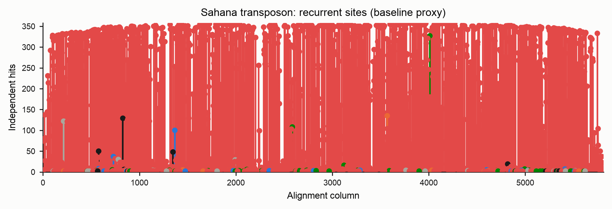

# Mutation spectra (SBS-96 / SBS-192)

RIP is one of several processes that deaminate cytosine in fungal repeats. To tell
them apart you need more than a count of C→T changes — you need the **sequence
context** each change happened in. `derip2-spectra` builds the standard
single-base-substitution spectra used in mutational-signature analysis:

- **SBS-96** — every substitution folded onto the pyrimidine strand, classified by
  its 5′ and 3′ neighbours: 6 substitution types × 16 contexts = 96 channels.
- **SBS-192** — the strand-resolved form (12 types × 16 contexts) that keeps the
  reference base as observed on the coding strand, so strand asymmetries stay
  visible.

RIP (CpA → TpA) shows up as a sharp `C>T` peak concentrated in `NCA` contexts:


The matrices are written in SigProfiler-compliant format, so they drop straight
into `SigProfilerPlotting` / `SigProfilerAssignment` if you want to decompose them
against COSMIC signatures later.

## Quick start

```bash
derip2-spectra -i family.fasta -d out -p family
```

This writes, into `out/`:

| File | Contents |
|---|---|
| `family.SBS96.txt`, `family.SBS192.txt` | SigProfiler-compliant count matrices |
| `family_SBS96.png`, `family_SBS192.png` | spectrum bar plots |
| `family_strand_asymmetry.png` | coding- vs template-strand counts per class |
| `family_homoplasy.png`, `family_homoplasy.tsv` | recurrently-hit sites |
| `family_events.tsv` | one row per called substitution |

## Two methods: baseline and phylogenetic

Direction and recurrence are not free from an alignment — you need an ancestor. The
tool offers two ways to get one.

### Baseline (`--method baseline`, the default)

Every sequence is compared to a **single reference** — deRIP2's reconstructed
ancestral consensus — and each difference is one event, with its context read from
that ancestor. It needs no tree and no external tools.

Its blind spot is **recurrence**. If the same C→T deamination struck independently
on many lineages, comparing every tip to one reference records the derived state on
each tip and cannot tell "one ancestral event inherited by twenty tips" from
"twenty independent events". The baseline therefore *over-counts* homoplasic sites
and reports recurrence only as a *multi-hit-column* proxy.

### Phylogenetic (`--method phylo`)

The rigorous path reconstructs ancestral sequences at every internal node of a tree
(IQ-TREE marginal ASR) and walks every parent→child branch, logging each
substitution as an independent event with its context read from the **parent**
sequence — the state at the moment the mutation occurred.

The difference is large and biological. On 60 Sahana copies:

| | Events (SBS-96) | Interpretation |
|---|---|---|
| Baseline | 38,727 | every tip vs one reference |
| Phylogenetic | 7,560 | independent branch events |

The baseline's extra ~31,000 "events" are shared/inherited RIP mutations counted
once per descendant. The phylogenetic path assigns each to the single branch it
arose on — and flags the sites that really were hit again and again:


!!! note "IQ-TREE is required for `--method phylo`"
    Install it separately (`conda install -c bioconda iqtree`) and make sure
    `iqtree3`, `iqtree2` or `iqtree` is on your `PATH`. `ete4` (a Python
    dependency) handles the tree.

```bash
# Infer the tree and reconstruct ancestors in one step
derip2-spectra -i family.fasta --method phylo -d out -p family
```

## Supplying your own phylogeny

You will usually get a better tree from a dedicated run than from the built-in
one-shot inference. Pass any Newick tree with `--tree`; IQ-TREE then keeps that
**topology fixed** (`-te`) and re-estimates the model, branch lengths and ancestral
states from your alignment.

```bash
# Build a well-supported tree however you like...
iqtree3 -s family.fasta -m MFP -B 1000 -T AUTO --prefix family_tree

# ...then reconstruct ancestral states on it and call the spectrum
derip2-spectra -i family.fasta --method phylo --tree family_tree.treefile \
    -d out -p family
```

!!! tip "Tip names"
    Tree leaf names must correspond to the FASTA sequence ids. IQ-TREE rewrites
    characters outside `[A-Za-z0-9._-]` to `_` in its output (so `scf:1-9(+)`
    becomes `scf_1-9___`); deRIP2 applies the same rule to match leaves back to
    sequences, so trees produced by IQ-TREE Just Work. If you supply a tree from
    another tool, keep tip names to those safe characters.

## Recommended: infer topology from a RIP-masked alignment

RIP mutations are **convergent** — the same CpA→TpA change happens independently in
many copies. To a tree-builder that convergence looks like shared ancestry, so a
tree built directly from RIP-riddled repeats can be pulled out of shape, grouping
copies by *how much they were RIP'd* rather than by their true history. That
distorted topology would then mis-assign the very substitutions you are trying to
count.

The fix is to **infer the topology from a RIP-masked alignment**, then reconstruct
ancestral states for the **unmasked** sequences on that same topology:

```bash
# 1. Mask RIP-corrected positions (degenerate IUPAC codes); no consensus appended
derip2 -i family.fasta --mask --no-append -d out -p family
#    -> out/family_masked_alignment.fasta

# 2. Infer the topology from the masked alignment (RIP signal removed)
iqtree3 -s out/family_masked_alignment.fasta -m MFP -B 1000 -T AUTO \
    --prefix out/family_masked

# 3. Reconstruct ancestral states for the UNMASKED sequences on that fixed
#    topology, and call the spectrum
derip2-spectra -i family.fasta --method phylo --tree out/family_masked.treefile \
    -d out -p family_spectrum
```

Why this works: masking removes the homoplasic RIP columns that mislead tree
search, giving a topology that reflects true descent. Step 3 then *fixes* that
topology (`--tree`) but re-derives branch lengths, the substitution model and the
ancestral sequences from the **full, unmasked** alignment — so the spectrum is
computed from the real substitutions while the tree shape is not an artefact of
RIP. The masked and unmasked alignments share identical tips and columns (masking
only rewrites bases in place), so the topology transfers exactly.

!!! note "Same topology, unmasked ancestors"
    The point of `--tree` here is precisely that the **topology comes from the
    masked tree** while the **ancestral sequences are recomputed for the unmasked
    data**. Do not run IQ-TREE ancestral reconstruction on the masked alignment —
    its ancestors would be masked too, and the spectrum would be blank exactly
    where RIP acted.

## Reading the outputs

### Homoplasy (recurrence)

The homoplasy report lists sites hit by the same substitution on two or more
independent lineages — the explicit, measured record of recurrent deamination.
Under `--method phylo` these are counts of **independent branches**; under the
baseline they are the multi-hit-column proxy.



### Strand asymmetry

From the SBS-192 matrix, each pyrimidine class is compared to its
reverse-complement partner, with a binomial screening p-value. This is where
enzyme-, replication- or transcription-linked strand biases show up.


### Per-lineage spectra

`--partition-by clade` (phylo) splits the matrices into one sample column per
subtree hanging off the root, so `SigProfilerPlotting` renders one panel per
lineage — useful for spotting lineage-specific deamination. `--partition-by row`
does the analogous per-sequence split for the baseline.

### Run manifest

The phylo path writes `*_run_manifest.json` recording the IQ-TREE version, the
model, the rooting method and the root node, node/edge counts, and — with
`--root-sensitivity` — the fraction of edges whose direction flips under midpoint
rooting. Directionality depends on the root, so record it.

## Useful options

| Option | Purpose |
|---|---|
| `--sbs {96,192,both}` | which matrices/plots to produce |
| `--rooting {midpoint,outgroup,none}` | how to root (sets substitution direction) |
| `--outgroup NAME[,NAME…]` | outgroup tip(s) for `--rooting outgroup` |
| `--iqtree-model` | IQ-TREE model (default `MFP`) |
| `--threads` | IQ-TREE `-T` (default `AUTO`; pass an integer to skip its benchmark on small alignments) |
| `--min-prob` | drop phylo events below this parent × child ancestral posterior |
| `--partition-by {none,row,clade}` | pool, per-sequence, or per-clade samples |
| `--root-sensitivity` | report how much polarity depends on the rooting choice |
| `--ancestor FASTA` | baseline only: call against a supplied ancestor instead of the deRIP consensus |

## Decomposing against COSMIC signatures

Because the matrices are SigProfiler-compliant, you can fit them to reference
signatures with the SigProfiler tools (installed separately):

```python
import sigProfilerPlotting as sigPlt
sigPlt.plotSBS('out/family.SBS96.txt', 'out/plots/', 'family', '96')
```

Interpret single-gene or single-family fits cautiously: COSMIC signatures were
derived on whole-genome trinucleotide opportunities, so a normalisation caveat
applies.
