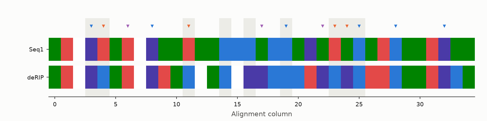
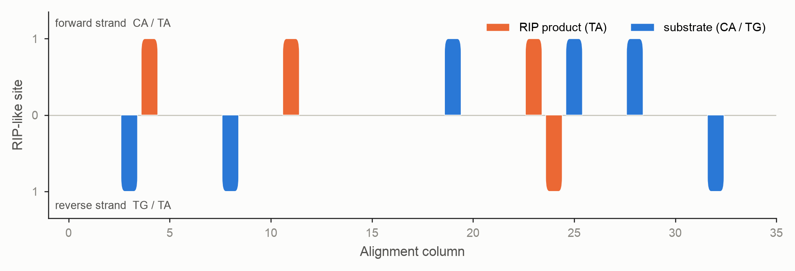
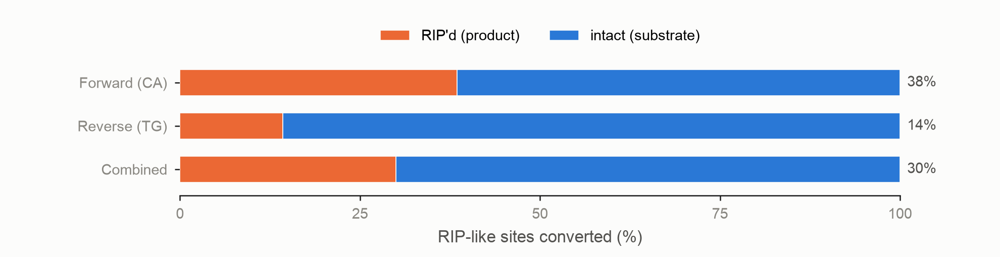
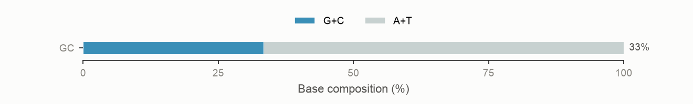
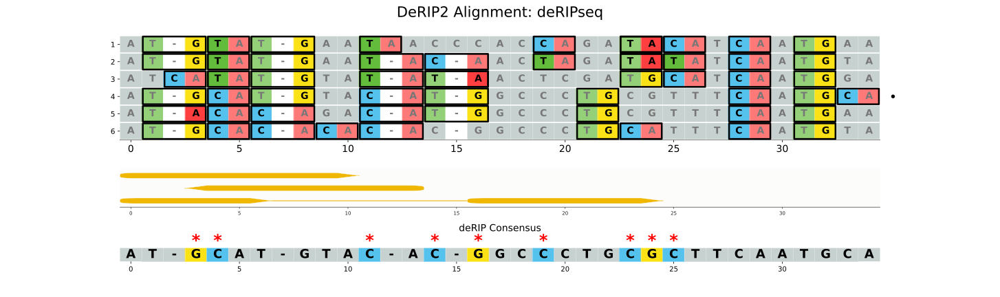

# Per-sequence HTML reporting

deRIP2's other outputs summarise a repeat family *as a whole* — the deRIP'd
consensus, the alignment-wide strand-bias figure, the pooled mutation spectrum.
This page covers the complementary view: an **interactive, per-sequence report**
that lets you inspect what RIP did to one family member at a time, and — when
you supply a gene model — what those mutations do to the encoded protein.

## The per-sequence report

```bash
derip2 -i tests/data/mintest.fa \
  --per-seq-report \
  -d results
```

This writes a single self-contained `results/deRIPseq_per_sequence.html`. Open
it in any browser and step through the sequences with the **left/right arrow
keys** (or the Prev/Next buttons). The header bar — sequence number, name and
ungapped length — stays pinned to the top as you scroll, and your scroll
position (both axes) is preserved between sequences so the same region stays in
view when you flip pages. Every figure is embedded as inline SVG, so the file
has no external assets — it can be emailed or archived as one file, and the
figures stay vector.

Each sequence gets a panel with several sections.

### Alignment row

The **subject** sequence (top) and the reconstructed **deRIP'd reference**
(below), each drawn base-by-base and coloured by nucleotide identity (A green,
C blue, G violet, T red; gaps white), separated by a narrow gap. Triangle
markers above the subject flag its role at each RIP-informative column —
**orange** for the RIP product, **blue** for the surviving substrate, **violet**
for non-RIP deamination. Columns the whole-alignment strand-bias analysis marks
as RIP-like are shaded grey, exactly as in the alignment-wide plot. A colour key
sits above the figure.



Long alignments scroll horizontally; the `−`/`+` **zoom** control in the toolbar
scales the alignment row and the strand-bias strip together, so they stay
aligned column-for-column as you zoom in to read individual bases.

### Per-sequence strand bias

A fixed-height binary strip: one bar per RIP-like column this sequence takes
part in. Forward-strand events sit **above** the axis, reverse-strand events
**below**, and each bar is coloured by whether the sequence's base is the RIP
product (**orange**, `TA`) or the surviving substrate (**blue**, `CA` on the
forward strand, `TG` on the reverse). Because a base is either product or
substrate, each column shows at most one bar — so the strip reads as a clean
yes/no map of where RIP struck this copy.



This is the single-sequence companion to the alignment-wide
[strand-bias figure](rip-strand-bias.md), which pools every sequence into
scaled bars.

### RIP completion and GC content

Two horizontal stacked bars summarise how far RIP has gone. **RIP completion**
shows the fraction of the available RIP-like sites (surviving substrate plus
product) that have been converted to product, per strand and combined:



**GC content** shows the sequence's base composition; RIP lowers GC by converting
C to T, so a low bar is consistent with heavy RIP:



### Mutation spectra

The sequence's **SBS-96** trinucleotide mutation spectrum measured against the
reconstructed ancestor, and a second **downstream-context** spectrum that
classifies each substitution by the mutated base plus its two downstream bases
(resolving the CHG-methylation `C>T` signal). These are the
[mutation-spectrum](mutation-spectra.md) analyses restricted to one row
(`calculate_spectra(partition_by='row')`), so RIP's `C>T` signature in `CpA`
context shows up per sequence. Each spectrum scrolls horizontally on its own so
the 96 channels never overlap.

### Flanking-context spectra of RIP-like sites

Not every substrate motif is converted to product in a RIP-affected sequence.
To ask whether a **local sequence context protects** a substrate from RIP, this
section classifies every RIP-like dinucleotide by the single base **1 bp
upstream and 1 bp downstream** — a 4 bp motif `[up][centre][down]` with the two
centre bases fixed and the flanks varying, giving **16 channels**. Two site
states are counted:

- **Substrate** — surviving `CpA` (forward strand) and `TpG` (reverse strand),
  counted *anywhere* in the sequence (not only in RIP-informative columns).
- **Product** — realised `TpA` sitting in a RIP-informative column.

Reverse-strand motifs are reverse-complemented onto the `CpA`/`TpA` strand, and
each strand view — **combined, forward, reverse** — is drawn as a **bihistogram**:
substrate counts (blue) extend left and product counts (orange) extend right of a
shared centre line. Each row is named on both sides — the **CA-state** (substrate)
motif on the left y-axis and the equivalent **TA-state** (product) motif on the
right (`GCAG` on the left ≡ `GTAG` on the right).

A motif is marked with a red `*` when its enrichment differs significantly between
the two states. For each of the 16 flank contexts the substrate and product counts
form one row of a 16×2 table, and that cell's **adjusted standardised (Haberman)
residual** is compared to the standard normal: the motif is flagged when
`|z| ≥ 1.96` (two-sided *p* < 0.05), provided both states have ≥ 20 sites, with no
multiple-testing correction. (On the pooled overview the counts are large enough
that almost every context clears this bar, so lean on the effect sizes there.)


Beneath the bihistograms, a **sortable per-motif table** lists each CA-state motif
with its combined substrate count, product count, total, and **% RIP** (the
product share of the total — how much of that context was converted). Sort the
motif column by its 5′ or 3′ flanking base, or any numeric column by value, to
find the most- and least-converted contexts. A second table reports the five
comparisons that test the protection hypothesis: substrate-vs-product flank
distribution (combined / forward / reverse) and forward-vs-reverse (substrate /
product). It leads with the scale-free **cosine similarity** (1 = identical flank
preference) and **Cramér's V**; the χ² p-value is shown only where both spectra
have enough sites (≥ 20 by default), and `*` marks `p < 0.05`.

The overview page carries the same tables **pooled across all sequences**, with
the bihistogram reduced to just the combined-strand panel (the per-sequence pages
keep the forward and reverse panels). With very large pooled counts almost every
context is flagged, so read the effect sizes rather than the marks.

To drive this analysis from Python — extracting the spectra, ranking motifs by
conversion, and comparing two spectra sets — see the
[Flank-context Spectra (API)](flank-context-spectra.md) tutorial.

Two companion tables are written alongside the report whenever
`--per-seq-report` is set:

- `prefix_rip_context_spectra.tsv` — tidy counts, one row per
  `sample × state × strand × channel` (the `combined` strand is the sum of
  `forward` and `reverse`).
- `prefix_rip_context_comparisons.tsv` — one row per `sample × comparison`
  carrying the cosine, Cramér's V, χ², p-value, site totals, reliability flag
  and most-differentiating channels.

### Summary statistics

That sequence's statistics, split into described cards — RIP events (including a
**total**), the strand-bias/RSI components, the composite RIP index (CRI), and
composition. A CRI above 1 is highlighted green, and a strand-asymmetry
`p-value` below 0.05 is shown in bold. These are the same values written by
`--stats-out`.

### Large alignments

Rendering hundreds of sequences produces hundreds of inline figures and a large
file. For big families, cap the report with `--max-report-seqs`:

```bash
derip2 -i tests/data/sahana.fasta.gz \
  --per-seq-report \
  --max-report-seqs 20 \
  -d results
```

The report then keeps the `N` sequences with the strongest strand bias (largest
`|RSI|`) and notes that it was truncated.

## Gene annotation and RIP effect reporting

If you have a gene model for one or more of the aligned sequences, supply it as
GFF3 with `--gff`. The sequence ids in the GFF must match the alignment record
ids, and coordinates are given in each sequence's own **ungapped** frame (1-based
inclusive); deRIP2 adjusts them for the gaps in the alignment automatically.

```bash
derip2 -i tests/data/mintest.fa \
  --gff tests/data/mintest.gff3 \
  --per-seq-report \
  --plot \
  -d results
```

Providing `--gff` turns on three things.

### An annotation track on the alignment figure

`--plot` gains a gene-annotation sub-plot between the alignment and the deRIP
consensus. Each gene occupies its own row, drawn as rounded CDS exon segments
joined across introns by a midline of the gene colour, with an arrowhead giving
the strand; a bold red `*` marks each stop codon in the deRIP'd consensus's
projected reading frame. Gaps in a sequence are accounted for so the track lines
up with the columns.



Override the default per-type colours with a two-column `type<TAB>hex` file via
`--annotation-colors`.

### CDS SNP-effect panels in the per-sequence report

Each annotated sequence's panel gains a **CDS SNP effects** table. deRIP2
assembles the sequence's CDS in transcription order (reverse-complementing
minus-strand genes and joining exons), translates it against the reconstructed
ancestor, and reports:

- **premature stops** — a codon that became a stop,
- **missense** — a non-synonymous amino-acid change,
- **frameshifts** — an indel that shifts the reading frame,
- **splice sites** — a broken canonical `GT`…`AG` intron boundary.

The panel also shows the **deRIP-restored protein**: the amino-acid sequence the
un-RIP'd (ancestral) CDS encodes, with `*` for any stop codon.

By default the standard NCBI genetic code (table 1) is used; select another with
`--genetic-code` (for example, `4` for some fungal mitochondrial genes).

### A SNP-effect summary file

`--gff` always writes `prefix_snp_effects.txt`, a tab-separated summary of every
effect per sequence, followed by the restored CDS translation for each gene:

```text
seq_id  gene_id  kind            aa_pos  ref_aa  alt_aa  gapped_col  nt_change
Seq1    mRNA1    missense        2       H       Y       5
Seq1    mRNA1    missense        3       V       E       9

# deRIP-restored CDS translations
# gene_id  protein
# mRNA1     MHV
```

## Python API

The same outputs are available on the `DeRIP` object:

```python
from derip2.derip import DeRIP

derip = DeRIP("tests/data/mintest.fa")
derip.calculate_rip()

# Per-sequence report (optionally with a gene model)
derip.write_per_sequence_report(
    "per_sequence.html",
    gff="tests/data/mintest.gff3",
    genetic_code=1,
    max_seqs=None,
)
```

Lower-level building blocks live in `derip2.annotation` (`parse_gff3`,
`predict_gene_effects`, `translate_cds`, `compute_effects_for_alignment`,
`write_snp_effects`) and `derip2.plotting.persequence`
(`per_sequence_strand_bias`, `sequence_row_strip`, `rip_completion_bar`,
`gc_content_bar`). The single-sample spectra are drawn by
`derip2.plotting.spectra.plot_sbs96`/`plot_downstream` with the `sample=`
argument.
