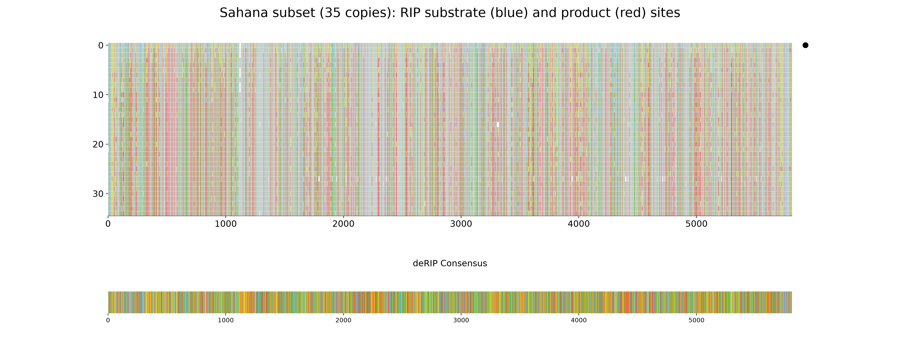
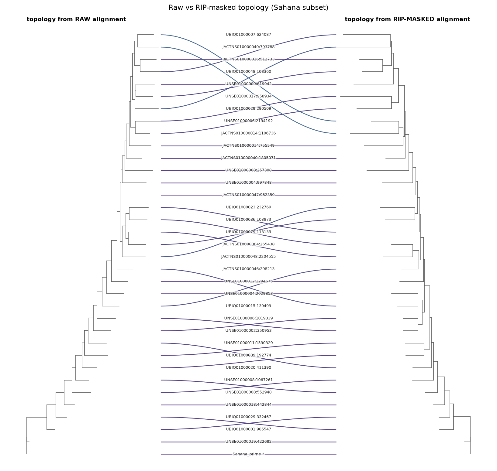

# Masking RIP for phylogenetics

RIP is a phylogeneticist's nightmare. It strikes the **same** `CpA` dinucleotides
independently in copy after copy, so the resulting `TpA` products are *convergent*:
they look like shared, derived characters to a tree-builder even though they arose
separately. A tree inferred straight from a family of RIP'd repeats is therefore
pulled out of shape — copies group by **how much RIP they have suffered** rather than
by their true descent.

This page shows how to defuse that with deRIP2:

1. **Mask** the RIP (and, optionally, all deamination) signal in the alignment.
2. Build phylogenies from the **raw** and **masked** alignments and compare them with a
   **tanglegram**.
3. Reconstruct on the RIP-free topology using the **unmasked** sequences, so branch
   lengths and ancestral states come from the real bases.

The biology of *why* RIP is strand-asymmetric and convergent is covered in the
[RIP strand bias](rip-strand-bias.md) tutorial; here we take it as given and focus on
the phylogenetic workflow. We use a 35-copy subset of the *Sahana* DNA transposon from
*Leptosphaeria maculans* (`tests/data/sahana.fasta.gz`), keeping the low-RIP reference
copy `Sahana_prime` as an outgroup.

!!! note "You need IQ-TREE"
    This tutorial calls IQ-TREE (`iqtree3`, `iqtree2` or `iqtree`), which is not
    pip-installable. Install it separately, e.g. `conda install -c bioconda iqtree`,
    and make sure the binary is on your `PATH`. Everything else uses deRIP2's core
    dependencies (`ete4`, `matplotlib`).

## 0. Build a working subset (optional)

You will normally start from your own curated family alignment. To reproduce the
figures on this page, pull a 35-copy subset out of the bundled *Sahana* alignment that
**spans the RIP range** — from the barely-touched reference to heavily-RIP'd copies —
so masking has something to change:

```python
from Bio.Align import MultipleSeqAlignment
from Bio import SeqIO
from derip2.derip import DeRIP

d = DeRIP('tests/data/sahana.fasta.gz')
d.calculate_cri_for_all()
cri = {c['id']: c['CRI'] for c in d.get_cri_values()}

# full-length copies only, then 34 evenly spaced across the CRI range + the reference
maxlen = max(len(str(r.seq).replace('-', '')) for r in d.alignment)
full = [r for r in d.alignment if len(str(r.seq).replace('-', '')) >= 0.9 * maxlen]
others = sorted((r for r in full if r.id != 'Sahana_prime'), key=lambda r: cri[r.id])
idx = sorted({round(i * (len(others) - 1) / 33) for i in range(34)})
prime = [r for r in full if r.id == 'Sahana_prime']

subset = MultipleSeqAlignment(prime + [others[i] for i in idx])
SeqIO.write(list(subset), 'sahana_subset.fasta', 'fasta')
```

## 1. Mask the RIP signal

deRIP2 masks corrected positions with **degenerate IUPAC codes**: a RIP product `T`
(and its unmutated `C` substrate) become `Y` (C/T), and the reverse-strand `A`/`G`
become `R` (A/G). This erases the *identity* of the deaminated base while preserving
that a base was there — exactly the columns that mislead tree search.

There are two masking depths:

| Mode | Masks | CLI | Python |
|---|---|---|---|
| **RIP-like only** *(default)* | Only deamination in RIP dinucleotide context (`CpA`↔`TpA`, `TpG`↔`TpA`) | `derip2 --mask` | `DeRIP(..., reaminate=False)` |
| **All deamination** | Every `C→T` / `G→A` transition, RIP-context or not | `derip2 --reaminate --mask` | `DeRIP(..., reaminate=True)` |

Use RIP-like masking when you specifically want RIP homoplasy gone but other variation
kept; use `--reaminate` when any cytosine deamination (including non-RIP methylation
damage) should be treated as noise for tree-building.

```bash
# RIP-like masking, no consensus row appended (we only want the masked copies)
derip2 -i sahana_subset.fasta --mask --no-append -d out -p sahana
#   -> out/sahana_masked_alignment.fasta
```

The equivalent from Python, which also writes the masked FASTA:

```python
from derip2.derip import DeRIP

d = DeRIP('sahana_subset.fasta', reaminate=False)
d.calculate_rip(label='sahana_deRIP')
d.write_alignment('sahana_masked.fasta', append_consensus=False, mask_rip=True)
```

!!! tip "`--no-append` matters for tree-building"
    By default `derip2` appends its deRIP'd consensus as an extra row. For a phylogeny
    you do not want that synthetic ancestor as a taxon, so pass `--no-append` (or
    `append_consensus=False`).

## 2. See what was masked

Plot the alignment to see where RIP struck. Substrate bases are blue, products red —
these are precisely the sites rewritten to `Y`/`R`:

```python
d.plot_alignment(
    output_file='sahana_masking.png',
    title='Sahana subset (35 copies): RIP substrate (blue) and product (red) sites',
    width=20, height=8, show_chars=False, show_rip='both',
)
```



RIP is spread across the whole element, and every red column is a convergence trap for
tree search. Masking neutralises them.

## 3. Build raw and masked phylogenies

Infer one tree from the **raw** alignment and one from the **masked** alignment. Root
both on the low-RIP reference `Sahana_prime` for correct polarity.

```bash
# Raw alignment
iqtree3 -s sahana_subset.fasta -m MFP -T AUTO -st DNA \
    -o Sahana_prime --prefix raw

# Masked alignment
iqtree3 -s out/sahana_masked_alignment.fasta -m MFP -T AUTO -st DNA \
    -o Sahana_prime --prefix masked
```

!!! warning "`-st DNA` is not optional on masked alignments"
    A heavily masked alignment is full of `Y`/`R` ambiguity codes. IQ-TREE's automatic
    sequence-type detection can choke on it and abort with *"Unknown sequence type"*.
    Forcing `-st DNA` avoids this. (For large families add `-fast` to keep the search
    quick; drop it and add `-B 1000` for a publication tree with bootstrap support.)

The two runs even select **different substitution models** — here `TIM2+F+R4` for the
raw alignment versus the simpler `HKY+F+R3` for the masked one, because masking removes
a lot of the (artefactual) rate heterogeneity RIP injected.

## 4. Compare the topologies with a tanglegram

A tanglegram draws both trees facing each other and links equivalent tips. Where the
lines run straight across, the two topologies agree; where they cross, RIP homoplasy
had moved a copy. deRIP2 does not ship a tanglegram function, but `ete4` (a core
dependency) plus matplotlib makes a compact one. Save this helper as `tanglegram.py`:

```python
--8<-- "docs/snippets/tanglegram.py"
```

Then draw it:

```python
from tanglegram import draw_tanglegram, _load

def short(name):  # IQ-TREE rewrites ':' etc. to '_'
    if name == 'Sahana_prime':
        return 'Sahana_prime *'
    scaffold, *rest = name.split('_')
    coord = rest[0].split('-')[0] if rest else ''
    return f'{scaffold.split(".")[0]}:{coord}' if coord else scaffold

labels = {leaf.name: short(leaf.name) for leaf in _load('raw.treefile').leaves()}
draw_tanglegram('raw.treefile', 'masked.treefile', 'sahana_tanglegram.png',
                labelmap=labels, title='Raw vs RIP-masked topology (Sahana subset)')
```



Connectors are coloured by how far each tip moves between the two trees (dark = stayed
put, bright = jumped), so the entangled crossings stand out. On this subset the two
topologies are substantially different — a normalised Robinson–Foulds distance of
**0.625** (40 of 64 possible splits differ):

```python
from ete4 import Tree
raw = Tree(open('raw.treefile').read())
masked = Tree(open('masked.treefile').read())
cmp = raw.compare(masked, unrooted=True)
print(cmp['norm_rf'])   # 0.625
```

That is the RIP artefact made visible: more than half the internal splits in the raw
tree are not supported once the convergent RIP columns are removed.

## 5. Reconstruct on the RIP-free topology, from the real sequences

The masked tree has an **honest topology** but useless branch lengths and ancestral
states — its sequences are full of `Y`/`R`. The fix is to **fix the masked topology**
and re-estimate everything else from the **unmasked** alignment. IQ-TREE's `-te` option
holds the topology constant while recomputing the model, branch lengths and (with
`-asr`) ancestral states:

```bash
iqtree3 -s sahana_subset.fasta -te masked.treefile -m MFP -T AUTO -st DNA \
    -o Sahana_prime --prefix fixedtopo
```

Now the tree shape reflects true descent (RIP could not distort it) while every branch
length and reconstructed substitution comes from the real bases. This is the tree you
want for downstream evolutionary analysis of the family.

!!! note "This is also how you get honest mutation spectra"
    The same masked-topology-plus-unmasked-sequences trick powers deRIP2's rigorous
    mutation-spectrum path. Instead of running `iqtree -te` by hand, hand the masked
    tree straight to `derip2-spectra`:

    ```bash
    derip2-spectra -i sahana_subset.fasta --method phylo \
        --tree masked.treefile -d out -p sahana_spectrum
    ```

    See [Mutation spectra → *Recommended: infer topology from a RIP-masked
    alignment*](mutation-spectra.md#recommended-infer-topology-from-a-rip-masked-alignment)
    for the full treatment, including why ancestral reconstruction must run on the
    unmasked sequences rather than the masked ones.

## Summary

| Step | Command | Output |
|---|---|---|
| Mask RIP | `derip2 --mask --no-append` | masked alignment (`Y`/`R`) |
| Raw tree | `iqtree3 -s raw.fasta ...` | possibly RIP-distorted topology |
| Masked tree | `iqtree3 -s masked.fasta -st DNA ...` | RIP-free topology |
| Compare | `ete4` tanglegram + norm-RF | how much RIP moved things |
| Final tree | `iqtree3 -te masked.treefile -s raw.fasta` | honest topology, real branch lengths |

The masked and unmasked alignments share identical tips and columns — masking only
rewrites bases in place — so the topology transfers exactly between them. Mask to find
the shape; use the real sequences for everything else.
