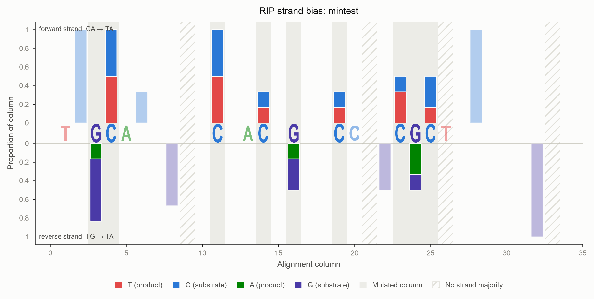
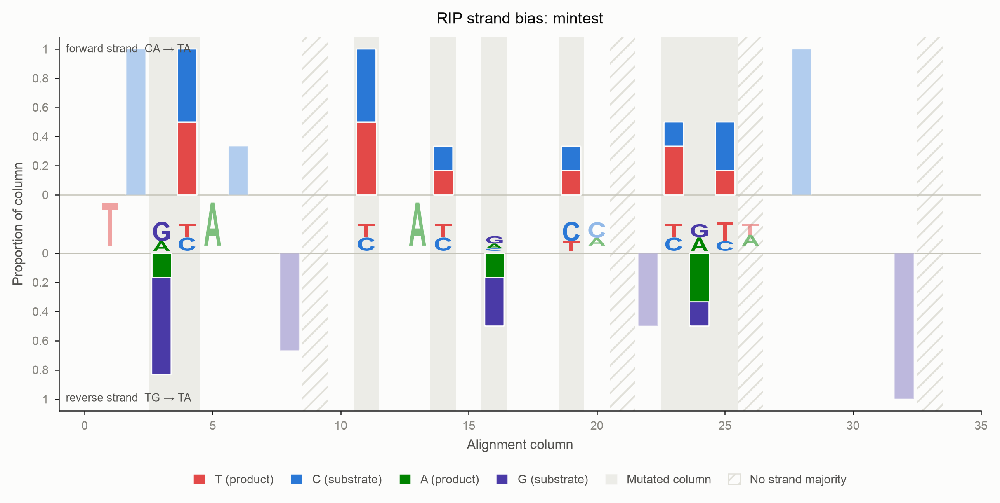
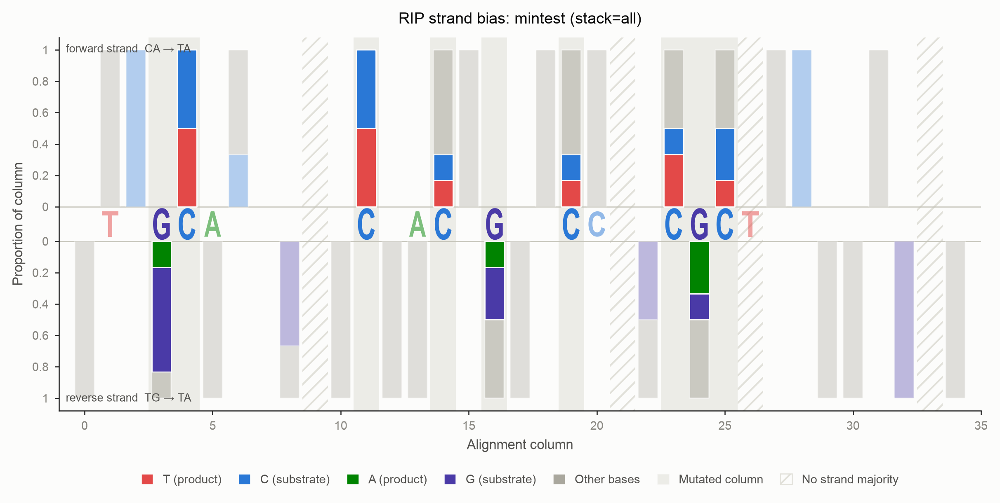

# RIP strand bias

Repeat-Induced Point mutation (RIP) does not strike both strands of a duplex
equally. This page explains why, how deRIP2 measures the asymmetry, and how to
read the figures it produces.

## The biology

RIP deaminates the cytosine of a **CpA** dinucleotide, turning `CA` into `TA`.
The enzyme works on either strand of the duplex, and this is where the
bookkeeping gets interesting.

Read a duplex on the forward strand. A reverse-strand `CA` appears on the
forward strand as `TG` — reverse-complement `TG` and you get `CA`. So RIP acting
on the reverse strand *also* produces a forward-strand `TA`:

```
                forward strand read 5' -> 3'

  forward-strand RIP:    C A   ->   T A
                         | |        | |
                         G T        A T

  reverse-strand RIP:    T G   ->   T A
                         | |        | |
                         A C        A T
```

`CA` and `TG` are the two **substrate** motifs. `TA` is the **product** motif,
and it is its own reverse complement, so it carries no memory of which strand it
came from.

The critical fact is that **a single round of meiotic RIP acts on one strand of
a given duplex**. Each progeny sequence from one round of meiosis therefore
accumulates mutations on one strand only: either its `CA` sites convert, or its
`TG` sites convert — rarely both. A sequence with a strong strand imbalance
bears the signature of a single round of RIP. A balanced sequence has either
escaped RIP entirely, or been RIP'd repeatedly until both strands ran out of
substrate.

## The statistic: RIP Strandedness Imbalance

For each sequence, count how much of the available substrate on each strand has
been converted:

```text
          CA sites converted to TA                 TG sites converted to TA
p_fwd = ----------------------------     p_rev = ----------------------------
        CA converted + CA still intact           TG converted + TG still intact

RSI = p_fwd - p_rev
```

RSI lies in `[-1, 1]`. Because each proportion is normalised against the
substrate actually available on its own strand, an alignment with far more `CA`
sites than `TG` sites does not bias the score.

| Sequence | `p_fwd` | `p_rev` | RSI |
|---|---|---|---|
| No RIP; all substrate intact | 0 | 0 | **0** |
| Every `CA` converted, every `TG` intact | 1 | 0 | **+1** |
| Every `TG` converted, every `CA` intact | 0 | 1 | **−1** |
| Both strands converted to exhaustion | 1 | 1 | **0** |
| One strand has no substrate and no product | — | — | **NaN** |

!!! warning "RSI = 0 is ambiguous on its own"
    A sequence that has never been RIP'd and a sequence RIP'd to exhaustion on
    both strands both score 0. **Always read RSI alongside `p_fwd` and
    `p_rev`**, which separate the two cases: `0, 0` means untouched, `1, 1`
    means saturated. deRIP2's statistics table always reports both.

A strand with neither substrate nor product yields `NaN`, not `0`. There is no
evidence either way, and reporting `0` would disguise "no data" as "perfectly
balanced".

## Substrates are observed; products are inferred

This asymmetry drives the whole implementation.

An unmutated `CA` in a sequence is **directly observed**. You can read it off the
sequence with no further reasoning.

A `TA`, however, is only evidence of RIP if you can show it *used to be*
something else. deRIP2 infers this from the alignment: if some other sequence
still carries an aligned, unmutated `CA` in that column, then the column was
ancestrally `CA` and this sequence's `TA` is a RIP product.

Two consequences follow.

**Substrates are counted everywhere; products only inside RIP columns.** If
products were counted from column context but substrates only from RIP columns
too, then a sequence with no RIP at all would score `0/0` instead of `0`.

!!! note "A fully converted column is invisible"
    If *every* sequence in a column has converted its `CA` to `TA`, no ancestral
    `C` survives anywhere, and the alignment carries no evidence the column was
    ever a RIP substrate. Such columns cannot be recognised and do not enter the
    statistic. **RSI can only see RIP that at least one sibling sequence
    escaped.** Add more diverged sequences to the alignment to recover them.

## The ambiguity, and how to resolve it

A `TA` dinucleotide spans two alignment columns: the `T` at column `i` and the
`A` at column `i+1`. It is evidence of forward RIP if column `i` holds an aligned
unmutated `C`. It is evidence of reverse RIP if column `i+1` holds an aligned
unmutated `G`. **When both are true, the strand of origin cannot be recovered
from the alignment.**

Here is exactly that case:

```
col:  0 1
      C A     <- unambiguous forward substrate (CA, intact)
      T A     <- AMBIGUOUS: from CA, or from TG?
      T A     <- AMBIGUOUS
      T A     <- AMBIGUOUS
      T G     <- unambiguous reverse substrate (TG, intact)
      C G     <- CG: neither substrate nor product
```

Column 0 holds both `C` and `T`, all followed by `A`, so it is a forward RIP
column. Column 1 holds both `G` and `A`, all preceded by `T`, so it is a reverse
RIP column. The three `TA` rows sit in both.

deRIP2 exposes four policies via `ambiguous=`, and always reports
`n_ambiguous` so the choice can be audited.

| Policy | Ambiguous `TA` contributes | When to use |
|---|---|---|
| `split` *(default)* | 0.5 to each strand | Unbiased when ambiguity is strand-symmetric. Uses all the data. |
| `exclude` | nothing to either strand | Most conservative. Discards the products of heavily RIP'd sequences. |
| `weight` | `w` forward, `1 - w` reverse, where `w = nC(i) / (nC(i) + nG(i+1))` | Follows the surviving evidence. Heuristic, no generative model. |
| `both` | 1.0 to each strand | Keeps counts integral, but inflates both proportions toward 1. |

On the symmetric example above, every policy returns **RSI = 0** — the
alignment really is balanced. They differ only in the magnitude of the
components:

| Policy | `p_fwd` | `p_rev` | RSI |
|---|---|---|---|
| `split` | 0.60 | 0.60 | 0.000 |
| `exclude` | 0.00 | 0.00 | 0.000 |
| `weight` | 0.60 | 0.60 | 0.000 |
| `both` | 0.75 | 0.75 | 0.000 |

The policy is not a cosmetic choice. On an **asymmetric** alignment the four can
disagree on the *sign* of RSI:

```
CACA
CATA
CATA
TATA
TATA
TGCG
```

Column 0 holds three intact `C` against a single intact `G` at column 1, so the
evidence for a forward origin is three times stronger.

| Policy | fwd product | rev product | `p_fwd` | `p_rev` | RSI |
|---|---|---|---|---|---|
| `split` | 5.0 | 1.0 | 0.556 | 0.500 | **+0.056** |
| `exclude` | 4.0 | 0.0 | 0.500 | 0.000 | **+0.500** |
| `weight` | 5.5 | 0.5 | 0.579 | 0.333 | **+0.246** |
| `both` | 6.0 | 2.0 | 0.600 | 0.667 | **−0.067** |

`exclude` throws away the ambiguous evidence and sees a clean forward signal;
`both` double-counts it and flips the sign. Report which policy you used.

!!! tip "CpG dinucleotides"
    A `CG` is neither substrate nor product: its `C` is not followed by `A`, and
    its `G` is not preceded by `T`. But an ancestral `CG` can diverge to `CA`
    (via G→A) or to `TG` (via C→T), and **both of those are genuine RIP
    substrates**. deRIP2 counts them as such. This falls out of the dinucleotide
    definitions and needs no special case.

### Significance

deRIP2 reports a two-sided two-proportion z-test of `p_fwd` against
`p_rev`, computed with `math.erfc` and no SciPy dependency. Treat it as a
screening heuristic:

- `split` and `weight` produce **fractional** counts, and the z-test assumes
  integers, so the p-value is approximate.
- `both` keeps counts integral but double-counts ambiguous events, inflating the
  trial counts and so overstating significance.
- A strand with no trials gives `NaN`. A pooled proportion of 0 or 1 forces
  `p_fwd = p_rev`, giving `z = 0` and `p = 1`.

## Reading the figure

Every alignment column that holds a base becomes one bar.

- **Above the axis**: the deamination is observed on the forward strand
  (`CA` → `TA`).
- **Below the axis**: it is observed on the reverse strand (`TG` → `TA`).
- The **product** segment always touches the zero line, so the extent of RIP can
  be compared across columns at a glance. The unmutated **substrate** stacks
  outward, and the outer edge of the bar is the column's total occupancy.
- Columns in which the chosen `mode` actually observed a transition carry a
  neutral grey **wash** behind the bar. Everything else is drawn faded: it is
  context, not signal. Pass `emphasis=False` for a flat render.

Because every non-gap base is either C/T or G/A, and the classifier uses a
*strict* majority, a column is never drawn on both sides. Columns where neither
strand holds a majority carry no correction, so they raise no bar; they are
hatched rather than dropped silently. Nothing else is ever drawn on the central
axis, which belongs to the sequence.

!!! note "Adjacent bars can describe the same event"
    A forward event is scored at the deaminated `C`'s column; the reverse event
    of the same duplex is scored at the `G`'s column, one position to the right.
    A single physical `TA` can therefore raise a bar above the axis at column
    `i` and below it at column `i+1`. That is the ambiguity, drawn.



## Worked example

```python
from derip2.derip import DeRIP

d = DeRIP('tests/data/mintest.fasta')
d.calculate_rip()

print(d.stats_summary())
```

```
 index   ID     GC    CRI    PI    SI    RSI p_fwd p_rev  ...  n_ambiguous  RIP_fwd  RIP_rev
     0 Seq1 33.333 -1.250 0.500 1.750  0.242 0.385 0.143  ...            1        3        1
     1 Seq2 22.581 -0.393 0.857 1.250  0.549 0.692 0.143  ...            1        5        1
     2 Seq3 31.250 -2.500 0.500 3.000  0.312 0.455 0.143  ...            1        3        1
     3 Seq4 48.387 -2.750 0.250 3.000  0.000 0.000 0.000  ...            0        0        0
     4 Seq5 45.161 -1.417 0.333 1.750 -0.250 0.000 0.250  ...            0        0        1
     5 Seq6 48.387 -1.467 0.333 1.800  0.000 0.000 0.000  ...            0        0        0
```

Read this table:

- **Seq2** has the strongest forward bias (RSI +0.549): 69% of its `CA` sites
  converted against 14% of its `TG` sites. Consistent with one round of RIP on
  the forward strand.
- **Seq5** is the only reverse-biased sequence (RSI −0.250): no forward
  conversion at all, 25% reverse conversion.
- **Seq4** and **Seq6** score RSI 0 — and because `p_fwd = p_rev = 0`, they are
  *unRIP'd*, not saturated. The components settle it.

Pool across the alignment and sort:

```python
pooled = d.rsi_result.pooled()
print(f"RSI={pooled['RSI']:+.3f}  p={pooled['pvalue']:.3g}")
# RSI=+0.181  p=0.11

for record in d.sort_by_rsi():          # most forward -> most reverse
    print(record.id, record.annotations['RSI'])
```

Sequences with an undefined RSI sort to the end in both directions: they carry
no evidence, so placing them at either extreme would misrepresent them.

### Choosing a policy

Passing a different policy recomputes RSI; it never silently reuses a result
computed under another policy.

```python
for policy in ('split', 'exclude', 'weight', 'both'):
    pooled = d.summarize_stats(ambiguous=policy)
    print(policy, d.rsi_result.pooled()['RSI'])
```

## Plotting

```python
# Publication figure: vector output, deRIP'd consensus along the axis
d.plot_strand_bias(
    output_file='strand_bias.svg',
    mode='rip',      # plot bars for event type {'rip', 'non_rip', 'all_deamination'}
    xaxis='derip',   # or 'logo' for a sequence logo, 'none'
    columns='rip',   # which positions to letter {'rip', 'substrate', 'all'}
    stack='signal',  # what each bar contains {'signal', 'product', 'all'}
    scale='column',  # each bar normalised to its own non-gap depth
)
```

### Lettering the axis

`columns` does not choose which columns are drawn — every column is. It chooses
which positions are **lettered** when `xaxis` is `'derip'` or `'logo'`:

| `columns` | Positions lettered |
|---|---|
| `all` *(default)* | Every position holding a base. |
| `rip` | Each RIP-like column, plus the partner base of its dinucleotide. |
| `substrate` | Columns holding substrate that RIP has demonstrably *not* touched — not RIP-like, not corrected, carrying no deamination product — plus their partners. |

A RIP motif spans two columns: the deaminated base and the base that gives it
its context. Under `columns='rip'` both are drawn, the site bold and the partner
faded, so a `CA` reads as a strong `C` followed by a receding `A`, and a `TG` as
a receding `T` followed by a strong `G`. Where the deRIP'd consensus carries a
gap, a muted dash is drawn — a bar is never left without a mark, and the figure
never borrows a base the consensus does not contain.

A sequence logo can replace the consensus letters. Glyph height encodes
information content, so an invariant column shows one tall letter and a variable
column shows a short stack:



### Long alignments

There is no column cap. The figure widens to fit the alignment, so a several-kb
alignment produces a very wide vector figure that can be zoomed. Write to `.svg`
or `.pdf`; a raster target warns when the bars would fall below one pixel. Use
`column_range=(start, end)` to zoom into a region instead.

### What the bars are made of

`stack` chooses which bases enter each bar:

| `stack` | Segments drawn |
|---|---|
| `signal` *(default)* | The RIP product and its unmutated substrate. Bases carrying no RIP signal are omitted. |
| `product` | The product alone — the cleanest read of where RIP struck. |
| `all` | Every base, with the remainder added as a translucent grey segment. |



Crucially, **no choice of `stack` ever rescales the bar**. The denominator is
always the column's full non-gap depth, so a short bar honestly reports that most
of the column was excluded rather than silently stretching to fill the axis.

### Scaling

| `scale` | Bar height means |
|---|---|
| `column` *(default)* | Fraction of that column's non-gap bases. Every full bar reaches 1.0. |
| `alignment` | Fraction of all sequences. A column that is 80% gaps reaches only 0.2. |
| `counts` | Raw number of sequences. |

Use `alignment` when gap structure matters and you do not want a column backed
by two sequences to look as confident as one backed by two hundred.

## From the command line

```bash
derip2 -i alignment.fa -d out -p sample \
  --plot-strand-bias \
  --strand-bias-xaxis derip \
  --strand-bias-columns rip \
  --strand-bias-stack signal \
  --rsi-ambiguous split \
  --sort-by-rsi \
  --stats-out \
  --html-report
```

This writes `sample_strand_bias.svg`, `sample_stats.tsv` and
`sample_report.html`. The report is a single self-contained file — inline SVG,
no external assets — carrying three panels (RIP-like mutations, non-RIP
deamination, and all deamination) plus the full statistics table.

The `non_rip` and `all_deamination` panels are the control: a strand bias that
appears in the RIP panel *and* in the non-RIP panel is not a RIP signal, it is a
property of the sequence composition.

!!! note "`--sort-by-rsi` and `--fill-index`"
    Sorting reorders rows, so a `--fill-index` given as a row position refers to
    a different sequence afterwards. deRIP2 re-runs the analysis against the
    sorted alignment and warns if both flags are used together. The deRIP'd
    consensus itself is unaffected — it is a property of the columns, not the
    row order.

## Colour

The figures use a palette validated for colourblind separation: worst all-pairs
Machado-2009 ΔE is 13.3 against a ≥12 target, every colour clears 3:1 contrast
against the surface, and all sit inside the OKLCH lightness band.

`C`, `T` and `A` keep their conventional colours. **`G` is violet rather than
the customary yellow**, because no yellow step reaches 3:1 contrast on a light
surface. Figures always render on their own light surface, as a printed figure
does, since the palette is only validated against it.

Pass `color_by='role'` to colour by the role a base plays (product, substrate,
noise) rather than by its identity.
